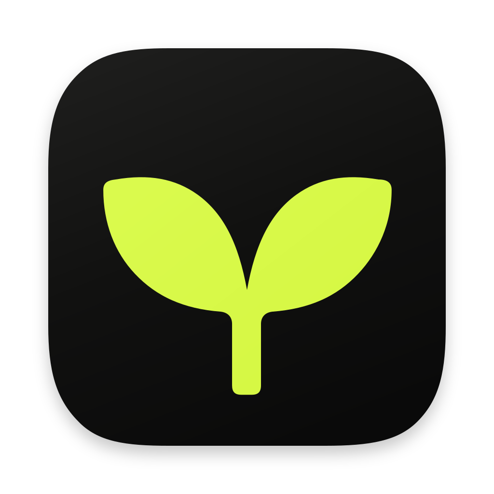
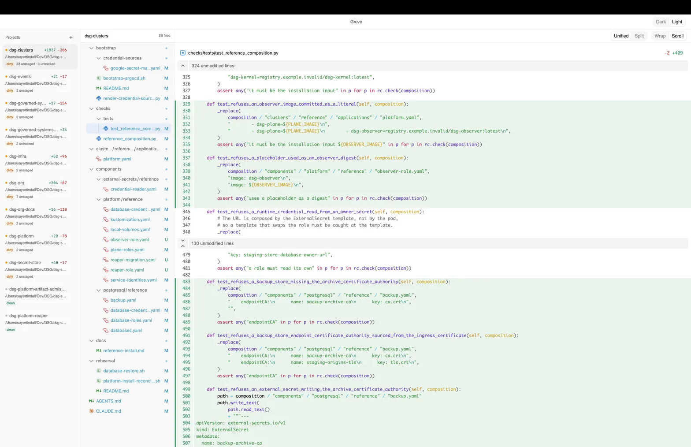

# Grove



A read-only macOS desktop viewer of git working-tree changes across the repositories you
register. It never stages, commits, pushes, pulls, edits files, or writes to a repository in
any way. The only things that leave your machine are a chat turn you explicitly send to a
provider you configured yourself and an update check you start from the menu — no telemetry,
no background checks, no other socket. It also ships a read-only CLI and an MCP server, so
agents and scripts can read exactly what the window shows. The name
is the model: a grove is many trees, and each registered repository is one tree shown beside
the others.

## Screenshot



Eleven registered repositories, `dsg-clusters` selected, with
`checks/tests/test_reference_composition.py` open: two hunks against `HEAD`, `-2 +409`,
the unchanged runs collapsed, and word-level highlighting inside the changed lines.

## Stack

| Library | Role |
| --- | --- |
| Tauri 2 | Desktop shell. Sixteen Rust commands and six events cross to the webview. |
| git2 | Opens a repository and reads status, branch, and diffs. The only git implementation. |
| notify-debouncer-full 0.7 | Recursive watches on registered roots, filtered by `.gitignore`, 300 ms debounce. |
| tauri-plugin-window-state | Restores the window's size and position. |
| tauri-plugin-store | Persists the project path list in the app data directory. |
| tauri-plugin-dialog | Directory picker, invoked from JavaScript only. |
| tauri-plugin-single-instance + deep-link | One running app; `grove://project/…` links (and a second launch) reach it. |
| tauri-plugin-global-shortcut | ⌘⇧G shows or hides the window from anywhere; configurable. |
| tauri-plugin-updater | Signed updates from the release's `latest.json`, only when you ask. |
| rmcp | The official MCP Rust SDK: `grove mcp` serves the nine read-only tools on stdio. |
| React 19 + TypeScript + Vite | UI, `strict` TypeScript. |
| Tailwind CSS 4 + coss ui | The component library. Components are vendored into `src/components/ui`. |
| TanStack Query 5 | Server state: the project list, one project's change list, and one file's diff. |
| @pierre/diffs 1.4.3 | `CodeView` renders the selected file; Shiki highlighting runs in a worker pool. |
| @pierre/trees 1.0.0-beta.6 | `FileTree` renders the changed files with built-in git status. |
| reqwest + hand-rolled SSE | Streams the chat provider (OpenAI-compatible and Anthropic). No agent framework sits between Grove and the model. |
| macOS Keychain (`keyring`) | Holds provider API keys. The app never logs or returns one. |
| Beautiful UI, ported | The chat surface's primitives, copied into `src/components/beautiful/` with its MIT notice and attribution. |

## Run

```bash
pnpm install
pnpm tauri dev
```

## Verify

```bash
./scripts/check_working_tree.sh                      # smoke fixture, then the cargo tests
pnpm build                                           # tsc --strict, then vite
cargo clippy --manifest-path src-tauri/Cargo.toml --all-targets
GROVE_LARGE_REPO=/path/to/a/big/repo \
  cargo test --manifest-path src-tauri/Cargo.toml -- --ignored --nocapture   # warm read < 500 ms
```

### Desktop E2E

```bash
pnpm e2e:desktop                   # cargo build, then node e2e/desktop/run.mjs
GROVE_E2E_CHAT=1 pnpm e2e:desktop  # also sends a quick-action turn to a loopback SSE stub
```

Drives the real debug app (real IPC, real watcher, real WKWebView) against throwaway
fixture repositories — clean, dirty (staged, unstaged, partially staged, renamed,
untracked, binary, image, over 512 KiB, whitespace-only), unborn `HEAD`, a linked
worktree, a moved submodule pointer, a review repo (`.env` with a credential-shaped
line, a lockfile, a long two-hunk file, an agent marker), a stopped merge conflict, and
a missing path — registered in a throwaway `GROVE_DATA_DIR`. It checks the sidebar
(triage order, counts, age, agent, risk chips) against `grove status --json` and
`grove changes --json`; the Stream layout's repo headers, viewed marks (persisting across
a relaunch, reset by an external edit), the Unviewed filter, and the Tour's j/k steps;
then, in the File layout, every file kind, views, split/unified, whitespace, context
lines, n/p hunk navigation, image modes, the conflict view, ⌘K, ⌘Y, ⌘,, a
`grove://navigate` event, timed live updates, remove/undo, and the assistant's quick
action plus the cloud pre-send sheet. It writes
`e2e/desktop/reports/<timestamp>/report.md` (fixture recreation steps, commands, expected
vs observed, captures, invisibility samples, watcher latencies) and exits non-zero on
any unexpected failure or if grove was ever frontmost.

The harness talks to a debug-only automation bridge (`src-tauri/src/automation.rs`,
absent from release builds) over the unix socket named by `GROVE_AUTOMATION_SOCKET`.
With that variable set the app is invisible by construction: `Prohibited` activation
policy (no Dock icon, never frontmost), no window-state restore, and a transparent,
click-through window ordered in behind others so WebKit keeps rendering. Captures are
WebKit snapshots, not screen grabs, so no Screen Recording permission is needed. A debug
build loads the frontend from Vite on port 1420; the harness starts `pnpm dev` if nothing
serves it.

## Icon

`design/grove-icon.svg` is the source art: a 1024 canvas with a charcoal continuous-corner
tile (824 px, inset 100 px) and a lime two-leaf sprout on it, transparent outside the tile.
`pnpm icon` regenerates `src-tauri/icons` from it, including the `.icns` layer set the bundle
wants.

The CLI also emits iOS, Android, and Microsoft Store variants; a macOS-only bundle
references none of them, so those files are deleted after each run.

macOS 26 Liquid Glass icons need an Icon Composer `.icon` file inside an Xcode project.
A Tauri bundle ships a static `.icns`, so Grove keeps the classic icon.

## Chat

Grove has one free-flowing assistant and **no modes** — one prompt, one tool set. Ask about
the changes in a project and it answers from Grove's own facts. A row of quick actions —
Explain file, Explain repo, Since last viewed (the files whose content changed after you
marked them viewed), Draft commit message — sends a templated question with the diffs in
view attached. Explain repo also proposes a review tour you can apply to the Tour layout.

It is not a coding agent and it cannot write. Its entire capability is nine read-only
readers: project status, change lists, diffs, file contents, a search across changed files,
worktrees, recent commits, file history, and blame. Every path argument is validated to be
inside a registered project, so it cannot read anything else. Answers cite `path:line`, and
the source list is derived from the tools it actually called rather than from parsing its
prose — so a citation is evidence, not a claim.

Findings the model reports in changed lines show as P0/P1/P2 cards, but only when they fall
inside a hunk of the file they name; the rest are counted, not shown. Drafts (commit message,
PR description, standup) come with a copy button — Grove never commits or posts them. Each
repository's `AGENTS.md`, `CLAUDE.md`, `.github/copilot-instructions.md`, and
`.cursor/BUGBOT.md` (16 KiB in total) join the prompt as review guidance.

Configure a provider in the panel's settings: Anthropic, an OpenAI-compatible endpoint
(OpenAI, DeepSeek, Groq, OpenRouter), Ollama (`http://127.0.0.1:11434/v1`) or LM Studio
(`http://127.0.0.1:1234/v1`), or the locally installed `claude` or `codex` CLI with its own
login. A delegated CLI gets the diffs in its prompt instead of Grove's tools and runs with its
own tools disabled (`claude --tools ""`) or sandboxed read-only (`codex --sandbox read-only`)
in an empty directory. Keys resolve in this order:

1. `GROVE_CHAT_KEY`
2. the provider's own environment variable (`OPENAI_API_KEY`, `ANTHROPIC_API_KEY`, …)
3. the macOS Keychain (never read for a loopback host, which may run without a key)

Cloud egress is off until you allow it. Before a turn leaves the machine, a sheet lists what
it carries — the attached diffs, the question, the system prompt and tool schemas, the
replayed conversation, the rule files — with byte counts; a loopback turn skips the sheet.
Under the composer a live counter shows what the turn has sent. A never-send list keeps chosen
repositories away from any cloud provider: they vanish from the workspace list and the tools,
and a turn about one is refused. Token caps per turn, per session, and per month refuse a turn
before anything is sent and cap the answer's length. The optional summary cache answers a
byte-identical request from disk and marks it `cached`.

Settings live in `chat-settings.json` (mode 0600), the transcript in `chat-history.json`, month
totals in `chat-usage.json`, and cached answers in `chat-summary-cache.json`, beside the project
list in the app data directory.

## CLI

The app binary is also the CLI — the same read-only surface the window shows, for scripts
and agents:

```bash
grove status [--json]
grove changes [<project>] [--json]
grove diff <project> <file> [--view head|staged|unstaged] [--json]
grove worktrees [<project>] [--json]
grove ask "what changed here, and does anything look accidental?" [--project <path>]
```

A project argument is a registered absolute path or a display name (a unique prefix is
accepted). `--json` emits the same shapes the GUI consumes. Exit codes are 0 success, 1
runtime failure, 2 usage. `GROVE_DATA_DIR` points the store somewhere else, which is how the
CLI is exercised against throwaway repositories.

### MCP

`grove mcp` serves the assistant's nine read-only tools — the same specs, the same code, the
same registered-project guard as the chat — to any MCP client over stdio (JSON-RPC on
stdout, logs on stderr). The project list is re-read on every call, so a project added in the
window is visible immediately. For Claude Code:

```bash
claude mcp add grove -- /Applications/Grove.app/Contents/MacOS/grove mcp
```

## Desktop integration

- **Tray.** A template sprout in the menu bar with a `Grove · N dirty` tooltip. Clicking it
  opens a menu: Open Grove, one row per dirty project (`name · +n −n`, click to open it),
  and Quit. The rows come from the same read as the sidebar and refresh on every watcher
  event and project-list change. The designed popover is realized as this native menu for
  now; there is no custom tray window.
- **Global shortcut.** ⌘⇧G shows the window, or hides it when it is already in front. The
  shortcut is stored in `preferences.json` under `preferences.globalShortcut` and changed
  through `set_global_shortcut`; one without ⌘, ⌃, or ⌥ is rejected, because it would fire
  while typing in any app.
- **Links.** `grove://project/<path>` and `grove://project/<path>/file/<file>`, each segment
  percent-encoded (`encodeURIComponent`), open that project and file. A project that is not
  registered is shown with a notice, never registered by the link. macOS registers the
  scheme from the installed bundle, so links reach a built Grove in /Applications, not
  `pnpm tauri dev`.
- **Menu bar.** Grove, File, Edit, View, Navigate, Assistant, Window, and Help. Every Grove
  item emits `grove://menu` with an id from `MENU_ITEM_IDS` (`src-tauri/src/menu.rs`),
  mirrored by `MenuItemId` in `src/types/menu.ts`; a cargo test fails if they drift.

## Release

`.github/workflows/release.yml` builds the bundles and publishes them. Push a tag to
release, or start a run from the Actions tab:

```bash
git tag app-v0.1.2 && git push origin app-v0.1.2
```

The workflow runs the Rust tests and builds one `--target universal-apple-darwin` bundle
on `macos-latest`. The release carries the universal `.dmg`, the zipped `.app`, the
screenshot, and the updater's signed `.app.tar.gz`, `.sig`, and `latest.json`
(`tauri-action` replaces `__VERSION__` from `tauri.conf.json`). The tag and the asset names
both follow the version in `tauri.conf.json`, so bump that before tagging. A manual run
publishes immediately unless you tick the draft box.

**Update signing (required).** Generate the key pair once, locally, and never commit the
private half:

```bash
pnpm tauri signer generate -w ~/.tauri/grove.key
```

Store the private key and its password as the repository secrets
`TAURI_SIGNING_PRIVATE_KEY` and `TAURI_SIGNING_PRIVATE_KEY_PASSWORD`, and the public key as
the repository variable `TAURI_SIGNING_PUBLIC_KEY`. `plugins.updater.pubkey` in
`tauri.conf.json` is an empty placeholder; the workflow fills it through a `--config`
overlay, and a build without a key refuses to check for updates. A local
`pnpm tauri build` needs the same `TAURI_SIGNING_PRIVATE_KEY` in the environment, or
`--config '{"bundle":{"createUpdaterArtifacts":false}}'` to skip the updater archive.

**Apple signing and notarization (optional).** Add `APPLE_CERTIFICATE` (base64 `.p12`),
`APPLE_CERTIFICATE_PASSWORD`, `APPLE_SIGNING_IDENTITY`, `APPLE_API_ISSUER`, `APPLE_API_KEY`,
and `APPLE_API_KEY_P8` (the `.p8` contents, written to `APPLE_API_KEY_PATH` for notarytool)
as secrets. Without them the bundle is unsigned and macOS quarantines the first launch:
right-click the app and choose Open, or `xattr -dr com.apple.quarantine /Applications/Grove.app`.

## Layout

- `src-tauri/src/config.rs` persists the path list. `git.rs` reads status, branch, change
  lists, and single-file diffs. `discovery.rs` finds repositories. `watch.rs` watches,
  filters, re-arms, and emits. `commands.rs` adapts IPC. `lib.rs` builds the process.
- `src/App.tsx` holds selection and preferences. `src/queries.ts` owns the query keys and
  the watch-event patching. `src/api/grove.ts` wraps the commands. `src/components/`
  holds one component per pane plus `MissingProject`, `ImageDiff`, and `Splitter`.
- `src-tauri/src/chat/` is the assistant — provider seam, the nine read-only tools, the
  prompt, and the turn loop — and `src-tauri/src/cli.rs` is the subcommand surface.
  `src/components/chat/`, `src/hooks/useChatStream.ts`, and `src/api/chat.ts` are its panel
  and IPC.

## Notes

- **Watcher cache.** The debouncer runs with `NoCache`, not the crate's recommended
  file-id cache. That cache keeps a file id per file under every watched root: with
  eleven real repositories (~7 GB) the process grew from 77 MB to 415 MB in ten seconds
  and reached 3.2 GB, which is what "adding eleven projects broke it" was. Grove only
  needs to know *which project* changed, so the cache buys nothing.
- **Commands are async.** A synchronous command body runs on the main thread, and
  reading eleven repositories takes long enough that the window would stop drawing. The
  reads run on the blocking pool.
- A pane with no content is not shown: with no projects registered, or with a clean
  selected project, the window shows one empty state instead of an empty tree beside an
  empty diff.
- **Reads are sized to the view.** The sidebar list reads every project in parallel; a
  watch event re-reads only the projects it names. A project's change list carries paths,
  status, and line counts; the two content sides load for the selected file only.
- **Views.** Every tracked file offers Head, Staged, and Unstaged views; an untracked
  file has only Head. "Hide whitespace" re-reads with whitespace ignored, and files left
  with no change drop out.
- **Diff pane.** Changed lines show word-level (or character-level, or no) intra-line
  highlights. The footer sets unchanged context per hunk (1, 3, 10, or the whole file);
  folded runs between hunks expand in steps or all at once. `n`/`p` step through hunks,
  ⌘F finds text inside the diff while the diff pane has focus, and selecting lines offers
  "Ask about lines a–b" (⌘⏎). A clicked citation scrolls to and tints the cited lines.
- **The chat cannot write.** There is no write tool and no shell: the model's tool set is
  nine read-only readers, all path-guarded to registered projects. That is a structural
  guarantee rather than a policy, which is why the tool list is short and fixed.
- **History is read only to explain the present.** The assistant can read file history,
  blame, and recent commits for the change in front of you; the app never becomes a general
  history browser and a full commit graph is deliberately out of scope.

## Shortcuts

| Keys | Action |
| --- | --- |
| ⌘R | Re-read everything |
| ⌘1–⌘9 | Select the Nth visible project |
| ⌘F | Search the changed files (tree focused) or find in the diff (diff focused) |
| n / p | Next / previous hunk (focus outside a text field) |
| ⌘O | Add projects |
| ⌘L | Toggle the chat panel |
| ⌘⇧G | Show or hide Grove from any app (global; configurable) |
| ↑ ↓ | Move through projects (list focused) or files (tree focused) |
| Esc | Clear the file selection |
