# Grove desktop E2E report

## Summary

- Result: **PASS** — 37 passed, 0 expected failures (known issues), 0 unexpected failures
- Started: 2026-09-26T16:13:44.633Z on st-mb (Darwin 24.6.0, arm64)
- Source: fbe51a0 + uncommitted changes; binary `src-tauri/target/debug/grove` (debug build); Vite dev server started by the harness; chat turns not sent (set `GROVE_E2E_CHAT=1`)
- Invisible: yes — 2 launch(es), LaunchServices type `BackgroundOnly`, `BackgroundOnly`; 0 of 41 `lsappinfo front` samples were grove; presence probes all alpha 0, never key, app never active (see [Invisibility checks](#invisibility-checks))
- App exits: relaunch: code 0 signal null; end: code 0 signal null; log: [app.log](app.log)
- Page responsiveness after captures: answered within 1 s after every capture

| # | scenario | status | capture |
| --- | --- | --- | --- |
| 1 | sidebar-matches-cli | PASS | [webkit-png](screenshots/01-sidebar-matches-cli.png) |
| 2 | stream-repo-headers | PASS | [webkit-png](screenshots/02-stream-repo-headers.png) |
| 3 | risk-chips | PASS | [webkit-png](screenshots/04-risk-chips.png) |
| 4 | submodule-stream-row | PASS | [webkit-png](screenshots/05-submodule-stream-row.png) |
| 5 | viewed-toggle | PASS | [webkit-png](screenshots/06-viewed-toggle.png) |
| 6 | unviewed-filter | PASS | [webkit-png](screenshots/07-unviewed-filter.png) |
| 7 | viewed-survives-relaunch | PASS | [webkit-png](screenshots/08-viewed-survives-relaunch.png) |
| 8 | viewed-resets-on-external-edit | PASS | [webkit-png](screenshots/09-viewed-resets-on-external-edit.png) |
| 9 | tour-steps | PASS | [webkit-png](screenshots/10-tour-steps.png) |
| 10 | clean-project | PASS | [webkit-png](screenshots/11-clean-project.png) |
| 11 | dirty-project-tree | PASS | [webkit-png](screenshots/12-dirty-project-tree.png) |
| 12 | text-diff-unstaged | PASS | [webkit-png](screenshots/13-text-diff-unstaged.png) |
| 13 | staged-file | PASS | [webkit-png](screenshots/14-staged-file.png) |
| 14 | partially-staged-views | PASS | [webkit-png](screenshots/15-partially-staged-views.png) |
| 15 | renamed-file | PASS | [webkit-png](screenshots/16-renamed-file.png) |
| 16 | untracked-file | PASS | [webkit-png](screenshots/17-untracked-file.png) |
| 17 | oversized-file | PASS | [webkit-png](screenshots/18-oversized-file.png) |
| 18 | binary-file | PASS | [webkit-png](screenshots/19-binary-file.png) |
| 19 | image-file | PASS | [webkit-png](screenshots/20-image-file.png) |
| 20 | split-toggle | PASS | [webkit-png](screenshots/21-split-toggle.png) |
| 21 | hide-whitespace | PASS | [webkit-png](screenshots/22-hide-whitespace.png) |
| 22 | unborn-head | PASS | [webkit-png](screenshots/23-unborn-head.png) |
| 23 | linked-worktree | PASS | [webkit-png](screenshots/24-linked-worktree.png) |
| 24 | submodule-pointer | PASS | [webkit-png](screenshots/25-submodule-pointer.png) |
| 25 | missing-project | PASS | [webkit-png](screenshots/26-missing-project.png) |
| 26 | command-palette | PASS | [webkit-png](screenshots/27-command-palette.png) |
| 27 | context-lines | PASS | [webkit-png](screenshots/28-context-lines.png) |
| 28 | hunk-navigation | PASS | [webkit-png](screenshots/29-hunk-navigation.png) |
| 29 | image-modes | PASS | [webkit-png](screenshots/33-image-modes.png) |
| 30 | conflict-view | PASS | [webkit-png](screenshots/34-conflict-view.png) |
| 31 | history-panel | PASS | [webkit-png](screenshots/38-history-panel.png) |
| 32 | settings-panel | PASS | [webkit-png](screenshots/40-settings-panel.png) |
| 33 | deep-link-navigate | PASS | [webkit-png](screenshots/41-deep-link-navigate.png) |
| 34 | live-external-edit | PASS | [webkit-png](screenshots/42-live-external-edit.png) |
| 35 | remove-and-undo | PASS | [webkit-png](screenshots/44-remove-and-undo.png) |
| 36 | chat-quick-action | PASS | [webkit-png](screenshots/45-chat-quick-action.png) |
| 37 | chat-cloud-sheet | PASS | [webkit-png](screenshots/47-chat-cloud-sheet.png) |


## How this run drives the app

The debug binary is spawned directly (never via `open`/LaunchServices) with `GROVE_AUTOMATION_SOCKET` and a throwaway `GROVE_DATA_DIR`. In that mode it is invisible by construction: the activation policy is `Prohibited` before the event loop starts (no Dock icon, cannot become active or frontmost), window-state restore (which shows and focuses) is not registered, and the window is created hidden, then made fully transparent (alpha 0), click-through, shadowless, excluded from Exposé/⌘` and the Window menu, and ordered in behind other windows without becoming key. It is ordered in because WebKit runs `requestAnimationFrame` (which the diff view renders through) only for a visible page; WKWebView occlusion detection is turned off so the transparent window still counts as visible. The harness evaluates JavaScript in the real WKWebView (real IPC, real watcher) and clicks what a person would click; captures are WebKit's in-process `takeSnapshotWithConfiguration`, never a screen grab.

## Commands

```sh
cargo build --manifest-path src-tauri/Cargo.toml
node e2e/desktop/run.mjs   # or: pnpm e2e:desktop
GROVE_DATA_DIR=/private/var/folders/68/hxhfgy_11gbdd627l4d_3_br0000gn/T/grove-e2e-nEUsMv/data GROVE_AUTOMATION_SOCKET=/private/var/folders/68/hxhfgy_11gbdd627l4d_3_br0000gn/T/grove-e2e-nEUsMv/automation.sock GROVE_CHAT_KEY=<placeholder> src-tauri/target/debug/grove  # spawned directly, never via open/LaunchServices
GROVE_DATA_DIR=/private/var/folders/68/hxhfgy_11gbdd627l4d_3_br0000gn/T/grove-e2e-nEUsMv/data src-tauri/target/debug/grove status --json
GROVE_DATA_DIR=/private/var/folders/68/hxhfgy_11gbdd627l4d_3_br0000gn/T/grove-e2e-nEUsMv/data src-tauri/target/debug/grove changes <project> --json
```

## Fixtures

Work directory: `/private/var/folders/68/hxhfgy_11gbdd627l4d_3_br0000gn/T/grove-e2e-nEUsMv` (repositories under `repos/`, store under `data/`). Registered projects, in stored order:

- `/private/var/folders/68/hxhfgy_11gbdd627l4d_3_br0000gn/T/grove-e2e-nEUsMv/repos/clean-repo`
- `/private/var/folders/68/hxhfgy_11gbdd627l4d_3_br0000gn/T/grove-e2e-nEUsMv/repos/dirty-repo`
- `/private/var/folders/68/hxhfgy_11gbdd627l4d_3_br0000gn/T/grove-e2e-nEUsMv/repos/unborn-repo`
- `/private/var/folders/68/hxhfgy_11gbdd627l4d_3_br0000gn/T/grove-e2e-nEUsMv/repos/main-repo`
- `/private/var/folders/68/hxhfgy_11gbdd627l4d_3_br0000gn/T/grove-e2e-nEUsMv/repos/linked-worktree`
- `/private/var/folders/68/hxhfgy_11gbdd627l4d_3_br0000gn/T/grove-e2e-nEUsMv/repos/super-repo`
- `/private/var/folders/68/hxhfgy_11gbdd627l4d_3_br0000gn/T/grove-e2e-nEUsMv/repos/review-repo`
- `/private/var/folders/68/hxhfgy_11gbdd627l4d_3_br0000gn/T/grove-e2e-nEUsMv/repos/conflict-repo`
- `/private/var/folders/68/hxhfgy_11gbdd627l4d_3_br0000gn/T/grove-e2e-nEUsMv/repos/missing-repo`

Recreate them (from `repos/`, with `GIT_CONFIG_GLOBAL=/dev/null`, author `Grove E2E <e2e@grove.invalid>`; `e2e/desktop/lib/fixtures.mjs` is the source of truth for file contents):

```sh
(cd clean-repo && git init -q -b main)
write clean-repo/README.md
(cd clean-repo && git add -A)
(cd clean-repo && git commit -q -m initial)
(cd dirty-repo && git init -q -b main)
write dirty-repo/staged.txt
write dirty-repo/unstaged.txt
write dirty-repo/partial.txt
write dirty-repo/old-name.txt
write dirty-repo/data.bin (8 bytes with NULs)
write dirty-repo/logo.png (24x24 green PNG)
write dirty-repo/spacing.txt
write dirty-repo/live.txt
(cd dirty-repo && git add -A)
(cd dirty-repo && git commit -q -m initial)
write dirty-repo/staged.txt
(cd dirty-repo && git add staged.txt)
write dirty-repo/unstaged.txt
write dirty-repo/partial.txt
(cd dirty-repo && git add partial.txt)
write dirty-repo/partial.txt
(cd dirty-repo && git mv old-name.txt new-name.txt)
write dirty-repo/data.bin (different binary bytes)
write dirty-repo/logo.png (24x24 red PNG)
write dirty-repo/spacing.txt (three whitespace-only edits, one real edit)
write dirty-repo/untracked.txt
write dirty-repo/large.txt (528384 bytes, over the 512 KiB cap)
(cd unborn-repo && git init -q -b main)
write unborn-repo/first.txt
(cd unborn-repo && git add first.txt)
write unborn-repo/notes.txt
(cd main-repo && git init -q -b main)
write main-repo/app.txt
(cd main-repo && git add -A)
(cd main-repo && git commit -q -m initial)
(cd main-repo && git worktree add -q -b feature ../linked-worktree)
write linked-worktree/app.txt
(cd sub-origin && git init -q -b main)
write sub-origin/lib.txt
(cd sub-origin && git add -A)
(cd sub-origin && git commit -q -m v1)
(cd super-repo && git init -q -b main)
write super-repo/main.txt
(cd super-repo && git add -A)
(cd super-repo && git commit -q -m initial)
(cd super-repo && git -c protocol.file.allow=always submodule add -q /private/var/folders/68/hxhfgy_11gbdd627l4d_3_br0000gn/T/grove-e2e-nEUsMv/repos/sub-origin vendor/sub)
(cd super-repo && git add -A)
(cd super-repo && git commit -q -m "add submodule")
write super-repo/vendor/sub/lib.txt
(cd super-repo/vendor/sub && git add -A)
(cd super-repo/vendor/sub && git commit -q -m v2)
(cd sub-origin && git rev-parse HEAD)
(cd super-repo/vendor/sub && git rev-parse HEAD)
(cd review-repo && git init -q -b main)
write review-repo/.env
write review-repo/package-lock.json
write review-repo/long.txt
write review-repo/viewed.txt
(cd review-repo && git add -A)
(cd review-repo && git commit -q -m initial)
write review-repo/.env (adds AWS's documented example access key id)
write review-repo/package-lock.json
write review-repo/long.txt (lines 20–59 and 280 edited)
write review-repo/viewed.txt
mkdir review-repo/.claude (agent marker, empty so git ignores it)
(cd conflict-repo && git init -q -b main)
write conflict-repo/conflict.txt
(cd conflict-repo && git add -A)
(cd conflict-repo && git commit -q -m base)
(cd conflict-repo && git checkout -q -b incoming)
write conflict-repo/conflict.txt
(cd conflict-repo && git add -A)
(cd conflict-repo && git commit -q -m theirs)
(cd conflict-repo && git checkout -q main)
write conflict-repo/conflict.txt
(cd conflict-repo && git add -A)
(cd conflict-repo && git commit -q -m ours)
(cd conflict-repo && git merge -q incoming)
```

Store: `/private/var/folders/68/hxhfgy_11gbdd627l4d_3_br0000gn/T/grove-e2e-nEUsMv/data/projects.json` = `{"projects": [...the paths above]}`.

## CLI oracle (`grove status --json`)

| project | state | staged | unstaged | untracked | + | − | dirty age (s) | agent | risks (from `grove changes`) |
| --- | --- | --- | --- | --- | --- | --- | --- | --- | --- |
| clean-repo | clean | 0 | 0 | 0 | 0 | 0 | — | — | — |
| dirty-repo | dirty | 3 | 5 | 2 | 10 | 8 | 1 | — | — |
| unborn-repo | dirty | 1 | 0 | 1 | 2 | 0 | 1 | — | — |
| main-repo | clean | 0 | 0 | 0 | 0 | 0 | — | — | — |
| linked-worktree | dirty | 0 | 1 | 0 | 1 | 0 | 1 | — | — |
| super-repo | dirty | 0 | 1 | 0 | 1 | 1 | 1 | — | — |
| review-repo | dirty | 0 | 4 | 0 | 45 | 43 | 0 | claude | secret, env, lockfile |
| conflict-repo | dirty | 0 | 1 | 0 | 0 | 0 | 0 | — | — |
| missing-repo | missing | 0 | 0 | 0 | 0 | 0 | — | — | — |

## Invisibility checks

grove processes (spawned directly, never through `open`/LaunchServices, so the ASN is inferred with type `BackgroundOnly`: no Dock icon, no menu bar, cannot be frontmost):

| launch | pid | ASN | type |
| --- | --- | --- | --- |
| launch | 72905 | `ASN:0x0-0xf2ed2de:` | `BackgroundOnly` |
| relaunch | 74313 | `ASN:0x0-0xf2f12e2:` | `BackgroundOnly` |

`lsappinfo front` samples (the owner switching apps changes the frontmost ASN; what must hold is that it is never grove's):

| when | frontmost ASN | pid | grove? |
| --- | --- | --- | --- |
| before fixtures | `ASN:0x0-0x1544543:` | 47579 | no |
| after launch | `ASN:0x0-0x1544543:` | 47579 | no |
| after sidebar-matches-cli | `ASN:0x0-0x1544543:` | 47579 | no |
| after stream-repo-headers | `ASN:0x0-0x1544543:` | 47579 | no |
| after risk-chips | `ASN:0x0-0x1544543:` | 47579 | no |
| after submodule-stream-row | `ASN:0x0-0x1544543:` | 47579 | no |
| after viewed-toggle | `ASN:0x0-0x1544543:` | 47579 | no |
| after unviewed-filter | `ASN:0x0-0x1544543:` | 47579 | no |
| after relaunch | `ASN:0x0-0x1544543:` | 47579 | no |
| after viewed-survives-relaunch | `ASN:0x0-0x1544543:` | 47579 | no |
| after viewed-resets-on-external-edit | `ASN:0x0-0x1544543:` | 47579 | no |
| after tour-steps | `ASN:0x0-0x1544543:` | 47579 | no |
| after clean-project | `ASN:0x0-0x1544543:` | 47579 | no |
| after dirty-project-tree | `ASN:0x0-0x1544543:` | 47579 | no |
| after text-diff-unstaged | `ASN:0x0-0x1544543:` | 47579 | no |
| after staged-file | `ASN:0x0-0x1544543:` | 47579 | no |
| after partially-staged-views | `ASN:0x0-0x1544543:` | 47579 | no |
| after renamed-file | `ASN:0x0-0x1544543:` | 47579 | no |
| after untracked-file | `ASN:0x0-0x1544543:` | 47579 | no |
| after oversized-file | `ASN:0x0-0x1544543:` | 47579 | no |
| after binary-file | `ASN:0x0-0x1544543:` | 47579 | no |
| after image-file | `ASN:0x0-0x1544543:` | 47579 | no |
| after split-toggle | `ASN:0x0-0x1544543:` | 47579 | no |
| after hide-whitespace | `ASN:0x0-0x1544543:` | 47579 | no |
| after unborn-head | `ASN:0x0-0x1544543:` | 47579 | no |
| after linked-worktree | `ASN:0x0-0x1544543:` | 47579 | no |
| after submodule-pointer | `ASN:0x0-0x1544543:` | 47579 | no |
| after missing-project | `ASN:0x0-0x1544543:` | 47579 | no |
| after command-palette | `ASN:0x0-0x1544543:` | 47579 | no |
| after context-lines | `ASN:0x0-0x1544543:` | 47579 | no |
| after hunk-navigation | `ASN:0x0-0x1544543:` | 47579 | no |
| after image-modes | `ASN:0x0-0x1544543:` | 47579 | no |
| after conflict-view | `ASN:0x0-0x1544543:` | 47579 | no |
| after history-panel | `ASN:0x0-0x1544543:` | 47579 | no |
| after settings-panel | `ASN:0x0-0x1544543:` | 47579 | no |
| after deep-link-navigate | `ASN:0x0-0x1544543:` | 47579 | no |
| after live-external-edit | `ASN:0x0-0x1544543:` | 47579 | no |
| after remove-and-undo | `ASN:0x0-0x1544543:` | 47579 | no |
| after chat-quick-action | `ASN:0x0-0x1544543:` | 47579 | no |
| after chat-cloud-sheet | `ASN:0x0-0x1544543:` | 47579 | no |
| after quit | `ASN:0x0-0x1544543:` | 47579 | no |

Window presence, read on the app's main thread:

| when | alpha | keyWindow | appActive | listedOnScreen |
| --- | --- | --- | --- | --- |
| after launch | 0 | false | false | true |
| before relaunch | 0 | false | false | true |
| after relaunch | 0 | false | false | true |
| after scenarios | 0 | false | false | true |

`listedOnScreen` is true while the alpha-0 window is ordered in (so WebKit keeps rendering); it composites no pixels.

## Watcher latencies

From the external write (this process) to the page showing the change (polled every 5 ms in the page); both clocks are this machine's wall clock.

| change | latency |
| --- | --- |
| edit to a viewed file → Viewed box clears | 368 ms |
| new file in the open project → tree row + sidebar count | 383 ms |
| edit to the open file → diff rows | 389 ms |

## Scenarios

### PASS — sidebar-matches-cli

**Expected:** One sidebar row per registered project in the default triage order (clean projects last, in the CLEAN section), whose staged/unstaged/untracked counts, +/− totals, “N dirty · age · agent” facts, risk chips, worktree label, and missing state equal `grove status --json` / `grove changes --json` (dirtyAgeSeconds, agent, risk).

| check | expected | observed | |
| --- | --- | --- | --- |
| row order (triage: dirty × risk × age, clean last) | `["/private/var/folders/68/hxhfgy_11gbdd627l4d_3_br0000gn/T/grove-e2e-nEUsMv/repos/review-repo","/private/var/folders/68/hxhfgy_11gbdd627l4d_3_br0000gn/T/grove-e2e-nEUsMv/repos/dirty-repo","/private/var/folders/68/hxhfgy_11gbdd627l4d_3_br0000gn/T/grove-e2e-nEUsMv/repos/unborn-repo","/private/var/folders/68/hxhfgy_11gbdd627l4d_3_br0000gn/T/grove-e2e-nEUsMv/repos/linked-worktree","/private/var/folders/68/hxhfgy_11gbdd627l4d_3_br0000gn/T/grove-e2e-nEUsMv/repos/super-repo","/private/var/folders/68/hxhfgy_11gbdd627l4d_3_br0000gn/T/grove-e2e-nEUsMv/repos/conflict-repo","/private/var/folders/68/hxhfgy_11gbdd627l4d_3_br0000gn/T/grove-e2e-nEUsMv/repos/missing-repo","/private/var/folders/68/hxhfgy_11gbdd627l4d_3_br0000gn/T/grove-e2e-nEUsMv/repos/clean-repo","/private/var/folders/68/hxhfgy_11gbdd627l4d_3_br0000gn/T/grove-e2e-nEUsMv/repos/main-repo"]` | `["/private/var/folders/68/hxhfgy_11gbdd627l4d_3_br0000gn/T/grove-e2e-nEUsMv/repos/review-repo","/private/var/folders/68/hxhfgy_11gbdd627l4d_3_br0000gn/T/grove-e2e-nEUsMv/repos/dirty-repo","/private/var/folders/68/hxhfgy_11gbdd627l4d_3_br0000gn/T/grove-e2e-nEUsMv/repos/unborn-repo","/private/var/folders/68/hxhfgy_11gbdd627l4d_3_br0000gn/T/grove-e2e-nEUsMv/repos/linked-worktree","/private/var/folders/68/hxhfgy_11gbdd627l4d_3_br0000gn/T/grove-e2e-nEUsMv/repos/super-repo","/private/var/folders/68/hxhfgy_11gbdd627l4d_3_br0000gn/T/grove-e2e-nEUsMv/repos/conflict-repo","/private/var/folders/68/hxhfgy_11gbdd627l4d_3_br0000gn/T/grove-e2e-nEUsMv/repos/missing-repo","/private/var/folders/68/hxhfgy_11gbdd627l4d_3_br0000gn/T/grove-e2e-nEUsMv/repos/clean-repo","/private/var/folders/68/hxhfgy_11gbdd627l4d_3_br0000gn/T/grove-e2e-nEUsMv/repos/main-repo"]` | ✓ |
| clean-repo counts | `{"staged":0,"unstaged":0,"untracked":0}` | `{"staged":0,"unstaged":0,"untracked":0}` | ✓ |
| clean-repo line totals | `[null,null]` | `[null,null]` | ✓ |
| clean-repo agent | `false` | `false` | ✓ |
| dirty-repo counts | `{"staged":3,"unstaged":5,"untracked":2}` | `{"staged":3,"unstaged":5,"untracked":2}` | ✓ |
| dirty-repo line totals | `["+10","−8"]` | `["+10","−8"]` | ✓ |
| dirty-repo dirty count | `"10 dirty"` | `"10 dirty"` | ✓ |
| dirty-repo dirty age (CLI 1s at start, 9s now) | `true` | `true` | ✓ |
| dirty-repo risk chips | `[]` | `[]` | ✓ |
| dirty-repo agent | `false` | `false` | ✓ |
| unborn-repo counts | `{"staged":1,"unstaged":0,"untracked":1}` | `{"staged":1,"unstaged":0,"untracked":1}` | ✓ |
| unborn-repo line totals | `["+2",null]` | `["+2",null]` | ✓ |
| unborn-repo dirty count | `"2 dirty"` | `"2 dirty"` | ✓ |
| unborn-repo dirty age (CLI 1s at start, 9s now) | `true` | `true` | ✓ |
| unborn-repo risk chips | `[]` | `[]` | ✓ |
| unborn-repo agent | `false` | `false` | ✓ |
| main-repo counts | `{"staged":0,"unstaged":0,"untracked":0}` | `{"staged":0,"unstaged":0,"untracked":0}` | ✓ |
| main-repo line totals | `[null,null]` | `[null,null]` | ✓ |
| main-repo agent | `false` | `false` | ✓ |
| linked-worktree counts | `{"staged":0,"unstaged":1,"untracked":0}` | `{"staged":0,"unstaged":1,"untracked":0}` | ✓ |
| linked-worktree line totals | `["+1",null]` | `["+1",null]` | ✓ |
| linked-worktree dirty count | `"1 dirty"` | `"1 dirty"` | ✓ |
| linked-worktree dirty age (CLI 1s at start, 9s now) | `true` | `true` | ✓ |
| linked-worktree risk chips | `[]` | `[]` | ✓ |
| linked-worktree agent | `false` | `false` | ✓ |
| linked-worktree worktree label | `true` | `true` | ✓ |
| super-repo counts | `{"staged":0,"unstaged":1,"untracked":0}` | `{"staged":0,"unstaged":1,"untracked":0}` | ✓ |
| super-repo line totals | `["+1","−1"]` | `["+1","−1"]` | ✓ |
| super-repo dirty count | `"1 dirty"` | `"1 dirty"` | ✓ |
| super-repo dirty age (CLI 1s at start, 9s now) | `true` | `true` | ✓ |
| super-repo risk chips | `[]` | `[]` | ✓ |
| super-repo agent | `false` | `false` | ✓ |
| review-repo counts | `{"staged":0,"unstaged":4,"untracked":0}` | `{"staged":0,"unstaged":4,"untracked":0}` | ✓ |
| review-repo line totals | `["+45","−43"]` | `["+45","−43"]` | ✓ |
| review-repo dirty count | `"4 dirty"` | `"4 dirty"` | ✓ |
| review-repo dirty age (CLI 0s at start, 9s now) | `true` | `true` | ✓ |
| review-repo risk chips | `["secret?","env","lockfile"]` | `["secret?","env","lockfile"]` | ✓ |
| review-repo agent | `"agent: claude"` | `"agent: claude"` | ✓ |
| conflict-repo counts | `{"staged":0,"unstaged":1,"untracked":0}` | `{"staged":0,"unstaged":1,"untracked":0}` | ✓ |
| conflict-repo line totals | `[null,null]` | `[null,null]` | ✓ |
| conflict-repo dirty count | `"1 dirty"` | `"1 dirty"` | ✓ |
| conflict-repo dirty age (CLI 0s at start, 9s now) | `true` | `true` | ✓ |
| conflict-repo risk chips | `[]` | `[]` | ✓ |
| conflict-repo agent | `false` | `false` | ✓ |
| missing-repo counts | `{"staged":0,"unstaged":0,"untracked":0}` | `{"staged":0,"unstaged":0,"untracked":0}` | ✓ |
| missing-repo line totals | `[null,null]` | `[null,null]` | ✓ |
| missing-repo agent | `false` | `false` | ✓ |
| missing-repo missing label | `true` | `true` | ✓ |

<details><summary>Observed</summary>

```json
[
  "1 dirty, review-repo +45 −43 4 dirty · 3s · agent: claude secret? env lockfile",
  "2 dirty, dirty-repo +10 −8 10 dirty · 3s",
  "3 dirty, unborn-repo +2 2 dirty · 3s",
  "4 dirty, linked-worktree +1 1 dirty · 3s · worktree of main-repo",
  "5 dirty, super-repo +1 −1 1 dirty · 3s",
  "6 dirty, conflict-repo 1 dirty · 3s",
  "7 missing, missing-repo not watching missing",
  "8 clean, clean-repo",
  "9 clean, main-repo"
]
```

</details>

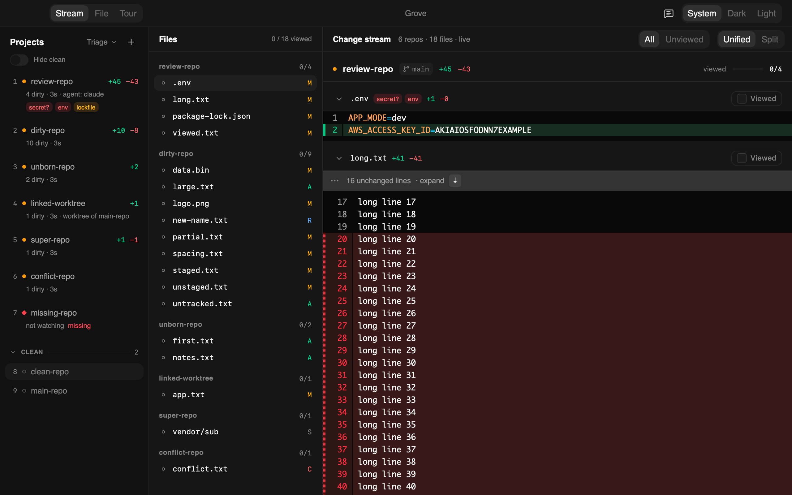

Duration: 102 ms

### PASS — stream-repo-headers

**Expected:** The Stream layout (the default) renders exactly one repo header per dirty project, each with the CLI's +n −n, and the header reads “N repos · M files”.

| check | expected | observed | |
| --- | --- | --- | --- |
| default layout | `"Stream"` | `"Stream"` | ✓ |
| one header per dirty project | `["/private/var/folders/68/hxhfgy_11gbdd627l4d_3_br0000gn/T/grove-e2e-nEUsMv/repos/conflict-repo","/private/var/folders/68/hxhfgy_11gbdd627l4d_3_br0000gn/T/grove-e2e-nEUsMv/repos/dirty-repo","/private/var/folders/68/hxhfgy_11gbdd627l4d_3_br0000gn/T/grove-e2e-nEUsMv/repos/linked-worktree","/private/var/folders/68/hxhfgy_11gbdd627l4d_3_br0000gn/T/grove-e2e-nEUsMv/repos/review-repo","/private/var/folders/68/hxhfgy_11gbdd627l4d_3_br0000gn/T/grove-e2e-nEUsMv/repos/super-repo","/private/var/folders/68/hxhfgy_11gbdd627l4d_3_br0000gn/T/grove-e2e-nEUsMv/repos/unborn-repo"]` | `["/private/var/folders/68/hxhfgy_11gbdd627l4d_3_br0000gn/T/grove-e2e-nEUsMv/repos/conflict-repo","/private/var/folders/68/hxhfgy_11gbdd627l4d_3_br0000gn/T/grove-e2e-nEUsMv/repos/dirty-repo","/private/var/folders/68/hxhfgy_11gbdd627l4d_3_br0000gn/T/grove-e2e-nEUsMv/repos/linked-worktree","/private/var/folders/68/hxhfgy_11gbdd627l4d_3_br0000gn/T/grove-e2e-nEUsMv/repos/review-repo","/private/var/folders/68/hxhfgy_11gbdd627l4d_3_br0000gn/T/grove-e2e-nEUsMv/repos/super-repo","/private/var/folders/68/hxhfgy_11gbdd627l4d_3_br0000gn/T/grove-e2e-nEUsMv/repos/unborn-repo"]` | ✓ |
| dirty-repo +n −n | `["+10","−8"]` | `["+10","−8"]` | ✓ |
| unborn-repo +n −n | `["+2","−0"]` | `["+2","−0"]` | ✓ |
| linked-worktree +n −n | `["+1","−0"]` | `["+1","−0"]` | ✓ |
| super-repo +n −n | `["+1","−1"]` | `["+1","−1"]` | ✓ |
| review-repo +n −n | `["+45","−43"]` | `["+45","−43"]` | ✓ |
| conflict-repo +n −n | `["+0","−0"]` | `["+0","−0"]` | ✓ |
| stream header counts | `"6 repos · 18 files"` | `"6 repos · 18 files"` | ✓ |
| file headers rendered while scrolling | `18` | `18` | ✓ |

<details><summary>Observed</summary>

```json
{
  "defaultLayout": "Stream",
  "files": 18,
  "header": "Change stream 6 repos · 18 files · live All Unviewed Unified Split",
  "repos": [
    {
      "file": null,
      "id": "repo:/private/var/folders/68/hxhfgy_11gbdd627l4d_3_br0000gn/T/grove-e2e-nEUsMv/repos/review-repo",
      "kind": "repo",
      "leaves": [
        "",
        "review-repo",
        "main",
        "+45",
        "−43",
        "",
        "viewed",
        "",
        "0/4"
      ],
      "project": "/private/var/folders/68/hxhfgy_11gbdd627l4d_3_br0000gn/T/grove-e2e-nEUsMv/repos/review-repo",
      "submodule": null,
      "text": "review-repo main +45 −43 viewed 0/4",
      "viewed": null
    },
    {
      "file": null,
      "id": "repo:/private/var/folders/68/hxhfgy_11gbdd627l4d_3_br0000gn/T/grove-e2e-nEUsMv/repos/dirty-repo",
      "kind": "repo",
      "leaves": [
        "",
        "dirty-repo",
        "main",
        "+10",
        "−8",
        "",
        "viewed",
        "",
        "0/9"
      ],
      "project": "/private/var/folders/68/hxhfgy_11gbdd627l4d_3_br0000gn/T/grove-e2e-nEUsMv/repos/dirty-repo",
      "submodule": null,
      "text": "dirty-repo main +10 −8 viewed 0/9",
      "viewed": null
    },
    {
      "file": null,
      "id": "repo:/private/var/folders/68/hxhfgy_11gbdd627l4d_3_br0000gn/T/grove-e2e-nEUsMv/repos/unborn-repo",
      "kind": "repo",
      "leaves": [
        "",
        "unborn-repo",
        "main",
        "+2",
        "−0",
        "",
        "viewed",
        "",
        "0/2"
      ],
      "project": "/private/var/folders/68/hxhfgy_11gbdd627l4d_3_br0000gn/T/grove-e2e-nEUsMv/repos/unborn-repo",
      "submodule": null,
      "text": "unborn-repo main +2 −0 viewed 0/2",
      "viewed": null
    },
    {
      "file": null,
      "id": "repo:/private/var/folders/68/hxhfgy_11gbdd627l4d_3_br0000gn/T/grove-e2e-nEUsMv/repos/linked-worktree",
      "kind": "repo",
      "leaves": [
        "",
        "linked-worktree",
        "feature",
        "+1",
        "−0",
        "",
        "viewed",
        "",
        "0/1"
      ],
      "project": "/private/var/folders/68/hxhfgy_11gbdd627l4d_3_br0000gn/T/grove-e2e-nEUsMv/repos/linked-worktree",
      "submodule": null,
      "text": "linked-worktree feature +1 −0 viewed 0/1",
      "viewed": null
    },
    {
      "file": null,
      "id": "repo:/private/var/folders/68/hxhfgy_11gbdd627l4d_3_br0000gn/T/grove-e2e-nEUsMv/repos/super-repo",
      "kind": "repo",
      "leaves": [
        "",
        "super-repo",
        "main",
        "+1",
        "−1",
        "",
        "viewed",
        "",
        "0/1"
      ],
      "project": "/private/var/folders/68/hxhfgy_11gbdd627l4d_3_br0000gn/T/grove-e2e-nEUsMv/repos/super-repo",
      "submodule": null,
      "text": "super-repo main +1 −1 viewed 0/1",
      "viewed": null
    },
    {
      "file": null,
      "id": "repo:/private/var/folders/68/hxhfgy_11gbdd627l4d_3_br0000gn/T/grove-e2e-nEUsMv/repos/conflict-repo",
      "kind": "repo",
      "leaves": [
        "",
        "conflict-repo",
        "main",
        "+0",
        "−0",
        "",
        "viewed",
        "",
        "0/1"
      ],
      "project": "/private/var/folders/68/hxhfgy_11gbdd627l4d_3_br0000gn/T/grove-e2e-nEUsMv/repos/conflict-repo",
      "submodule": null,
      "text": "conflict-repo main +0 −0 viewed 0/1",
      "viewed": null
    }
  ]
}
```

</details>

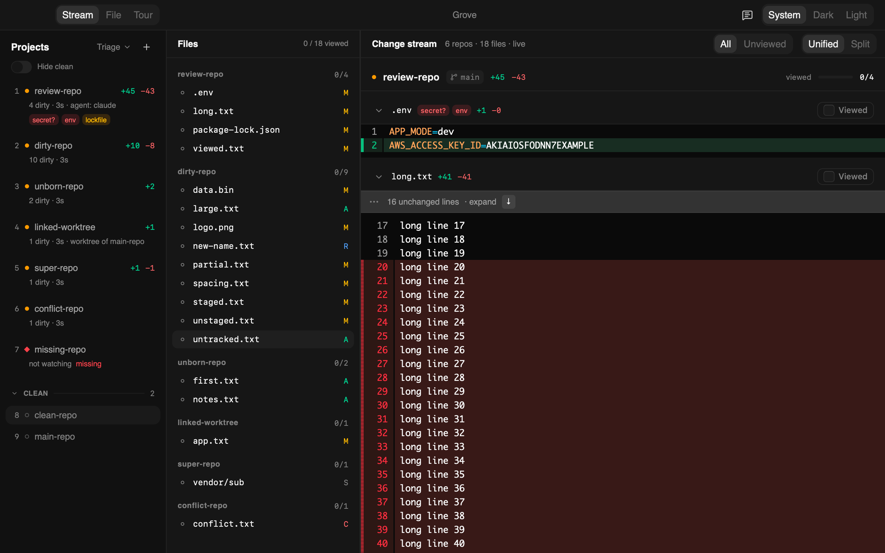

Duration: 1452 ms

### PASS — risk-chips

**Expected:** review-repo's .env (which gains an AWS-shaped key) carries the “secret?” and “env” chips, package-lock.json carries “lockfile” (and starts collapsed), long.txt carries none — matching `grove changes --json` risk.

| check | expected | observed | |
| --- | --- | --- | --- |
| .env chips | `["secret?","env"]` | `["secret?","env"]` | ✓ |
| package-lock.json chips | `["lockfile"]` | `["lockfile"]` | ✓ |
| long.txt chips | `[]` | `[]` | ✓ |
| lockfile starts collapsed | `true` | `true` | ✓ |
| CLI risk | `{".env":["secret","env"],"package-lock.json":["lockfile"],"long.txt":[]}` | `{".env":["secret","env"],"package-lock.json":["lockfile"],"long.txt":[]}` | ✓ |

<details><summary>Observed</summary>

```json
{
  "env": ".env secret? env +1 −0 Viewed",
  "lock": "package-lock.json lockfile +2 −2 Lockfile diff collapsed · 4 linesShow Viewed",
  "long": "long.txt +41 −41 Viewed"
}
```

</details>

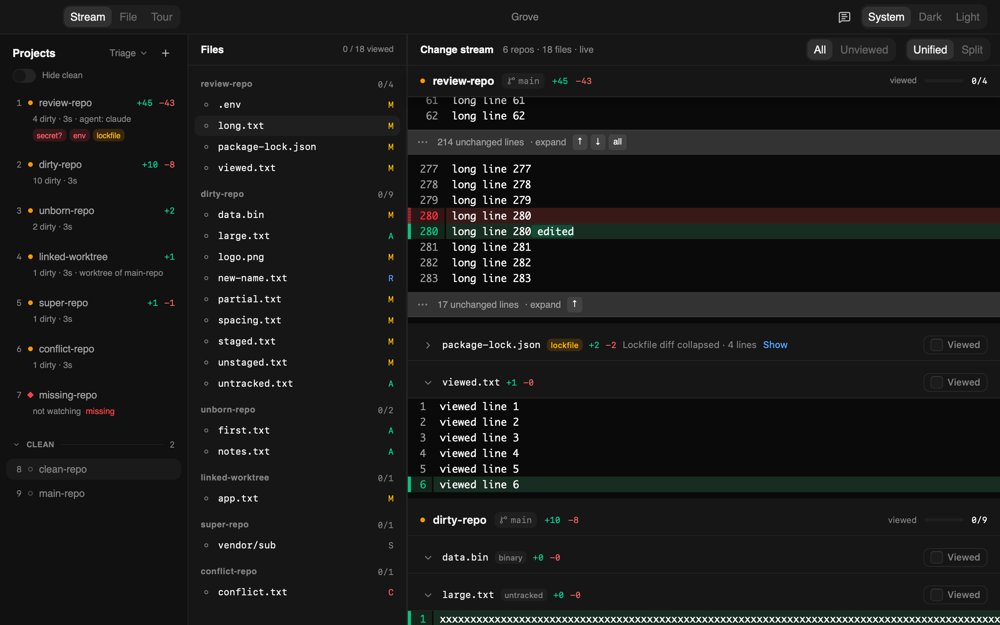


Duration: 1984 ms

### PASS — submodule-stream-row

**Expected:** super-repo's vendor/sub stream row shows the “submodule” chip and old → new short commits equal to the fixture's commits.

| check | expected | observed | |
| --- | --- | --- | --- |
| submodule chip | `true` | `true` | ✓ |
| old → new | `"submodule commit 1ac9389 to ab63442"` | `"submodule commit 1ac9389 to ab63442"` | ✓ |
| visible shas | `["1ac9389","ab63442"]` | `["1ac9389","ab63442"]` | ✓ |

<details><summary>Observed</summary>

```json
{
  "file": "vendor/sub",
  "id": "file:/private/var/folders/68/hxhfgy_11gbdd627l4d_3_br0000gn/T/grove-e2e-nEUsMv/repos/super-repo\u0000vendor/sub",
  "kind": "file",
  "leaves": [
    "vendor/sub",
    "submodule",
    "1ac9389",
    "→",
    "ab63442",
    "+1",
    "−1",
    "",
    ""
  ],
  "project": "/private/var/folders/68/hxhfgy_11gbdd627l4d_3_br0000gn/T/grove-e2e-nEUsMv/repos/super-repo",
  "submodule": "submodule commit 1ac9389 to ab63442",
  "text": "vendor/sub submodule 1ac9389 → ab63442 +1 −1 Viewed",
  "viewed": "false"
}
```

</details>

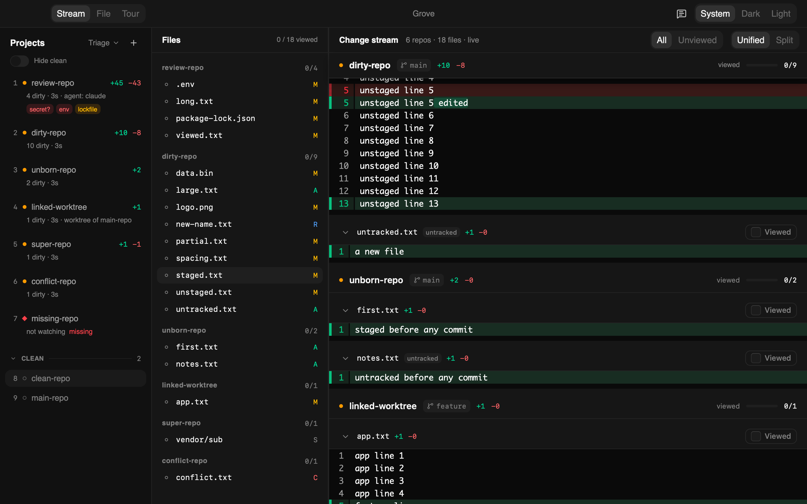

Duration: 1130 ms

### PASS — viewed-toggle

**Expected:** Ticking Viewed on review-repo's viewed.txt checks the box, the repo header reads 1 viewed, and review-state.json records the mark at the file's CLI contentHash.

| check | expected | observed | |
| --- | --- | --- | --- |
| box checked | `true` | `true` | ✓ |
| repo progress | `"1"` | `"1"` | ✓ |
| mark stored at the CLI contentHash | `true` | `true` | ✓ |

<details><summary>Observed</summary>

```json
{
  "checked": true,
  "progress": "1",
  "repoText": "review-repo main +45 −43 viewed 1/4",
  "store": [
    {
      "projectPath": "/private/var/folders/68/hxhfgy_11gbdd627l4d_3_br0000gn/T/grove-e2e-nEUsMv/repos/review-repo",
      "filePath": "viewed.txt",
      "contentHash": "fd03de92e75924726af42316e0af5d615c57f299"
    }
  ]
}
```

</details>

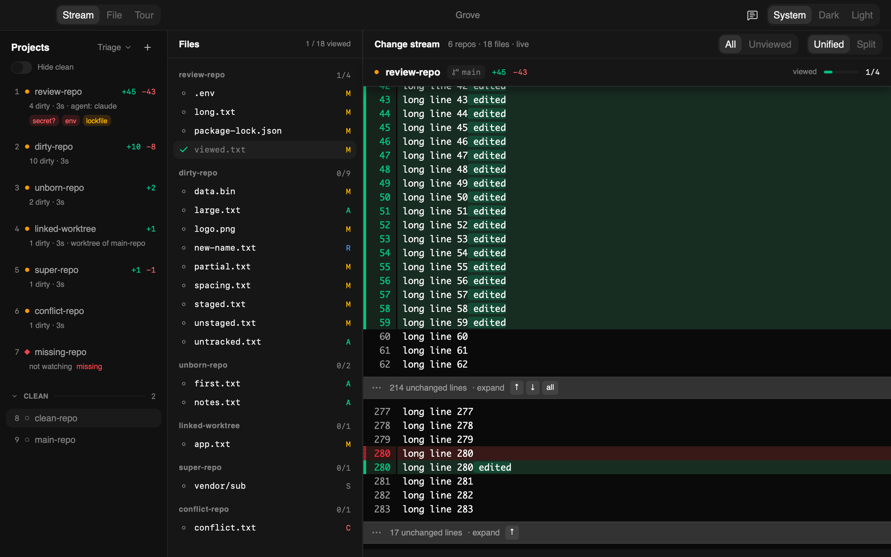

Duration: 685 ms

### PASS — unviewed-filter

**Expected:** With the stream filter on Unviewed, viewed.txt disappears from the stream while review-repo's other files stay; All brings it back.

| check | expected | observed | |
| --- | --- | --- | --- |
| Unviewed hides the ticked file | `[".env","long.txt","package-lock.json"]` | `[".env","long.txt","package-lock.json"]` | ✓ |
| All shows every file | `[".env","long.txt","package-lock.json","viewed.txt"]` | `[".env","long.txt","package-lock.json","viewed.txt"]` | ✓ |

<details><summary>Observed</summary>

```json
{
  "all": [
    ".env",
    "long.txt",
    "package-lock.json",
    "viewed.txt"
  ],
  "unviewed": [
    ".env",
    "long.txt",
    "package-lock.json"
  ]
}
```

</details>

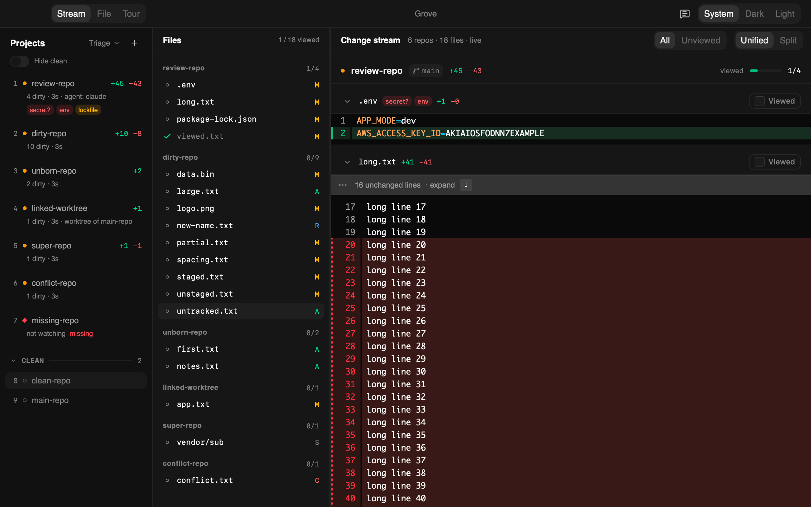

Duration: 3578 ms

### PASS — viewed-survives-relaunch

**Expected:** After quitting and relaunching the app (same store, still invisible), viewed.txt's Viewed box is still ticked.

| check | expected | observed | |
| --- | --- | --- | --- |
| still viewed after relaunch | `"true"` | `"true"` | ✓ |

<details><summary>Observed</summary>

```json
{
  "file": "viewed.txt",
  "id": "file:/private/var/folders/68/hxhfgy_11gbdd627l4d_3_br0000gn/T/grove-e2e-nEUsMv/repos/review-repo\u0000viewed.txt",
  "kind": "file",
  "leaves": [
    "viewed.txt",
    "+1",
    "−0",
    ""
  ],
  "project": "/private/var/folders/68/hxhfgy_11gbdd627l4d_3_br0000gn/T/grove-e2e-nEUsMv/repos/review-repo",
  "submodule": null,
  "text": "viewed.txt +1 −0 Viewed",
  "viewed": "true"
}
```

</details>

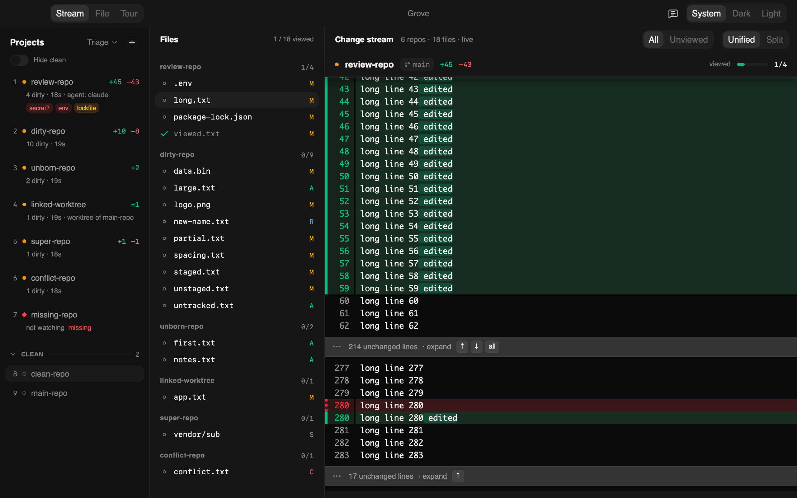

Duration: 1668 ms

### PASS — viewed-resets-on-external-edit

**Expected:** An external edit to viewed.txt changes its content hash, so its Viewed box clears (within 1000 ms of the write).

| check | expected | observed | |
| --- | --- | --- | --- |
| Viewed cleared | `true` | `true` | ✓ |
| latency ≤ 1000 ms | `true` | `true` | ✓ |

<details><summary>Observed</summary>

```json
{
  "focusAfter": false,
  "focusBefore": false,
  "seenAt": 1790439246373,
  "updated": true,
  "visibility": "visible",
  "writtenAt": 1790439246005,
  "latencyMs": 368
}
```

</details>

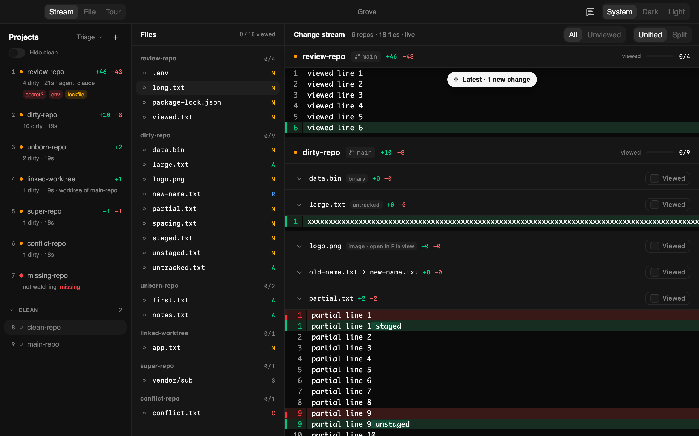

Duration: 1535 ms

### PASS — tour-steps

**Expected:** The Tour layout covers every changed file across dirty projects; k steps forward and j steps back, and the step bar reads “file k of n”.

| check | expected | observed | |
| --- | --- | --- | --- |
| n = changed files across dirty projects | `18` | `18` | ✓ |
| start | `"file 1 of 18"` | `"file 1 of 18"` | ✓ |
| k | `"file 2 of 18"` | `"file 2 of 18"` | ✓ |
| j | `"file 1 of 18"` | `"file 1 of 18"` | ✓ |

<details><summary>Observed</summary>

```json
{
  "back": {
    "label": "file 1 of 18",
    "max": 18,
    "now": 1
  },
  "forward": {
    "label": "file 2 of 18",
    "max": 18,
    "now": 2
  },
  "start": {
    "label": "file 1 of 18",
    "max": 18,
    "now": 1
  }
}
```

</details>

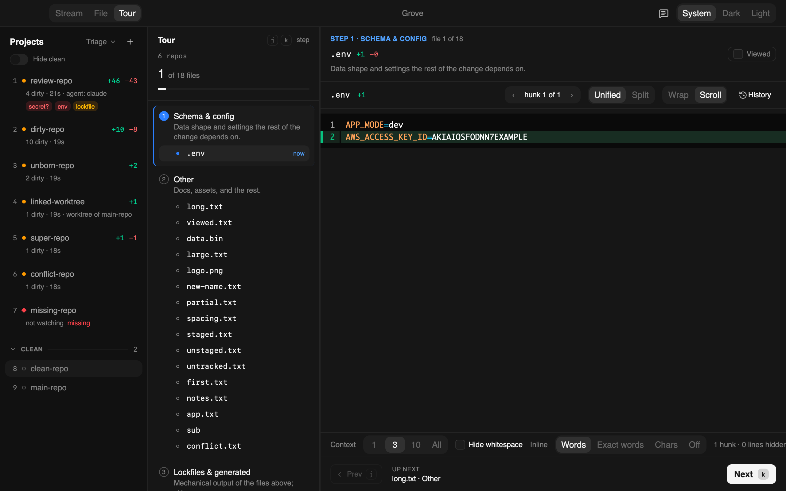

Duration: 612 ms

### PASS — clean-project

**Expected:** In the File layout, selecting clean-repo shows “Working tree matches HEAD”.

| check | expected | observed | |
| --- | --- | --- | --- |
| empty state | `true` | `true` | ✓ |

<details><summary>Observed</summary>

```json
"Projects Triage Hide clean 1 dirty, review-repo +46 −43 4 dirty · 21s · agent: claude secret? env lockfile 2 dirty, dirty-repo +10 −8 10 dirty · 19s 3 dirty, unborn-repo +2 2 dirty · 19s 4 dirty, linked-worktree +1 1 dirty · 19s · worktree of main-repo 5 dirty, super-repo +1 −1 1 dirty · 18s 6 dirty, conflict-repo 1 dirty · 18s 7 missing, missing-repo not watching missing CLEAN 2 8 clean, clean-re"
```

</details>

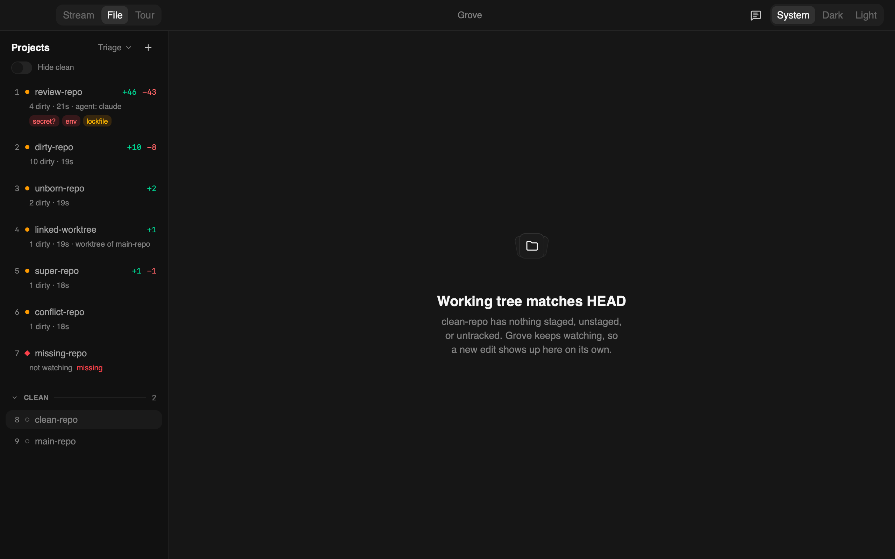

Duration: 98 ms

### PASS — dirty-project-tree

**Expected:** Selecting dirty-repo lists exactly the files `grove changes --json` lists, and the header count equals their number.

| check | expected | observed | |
| --- | --- | --- | --- |
| header count | `9` | `9` | ✓ |
| tree paths | `["data.bin","large.txt","logo.png","new-name.txt","partial.txt","spacing.txt","staged.txt","unstaged.txt","untracked.txt"]` | `["data.bin","large.txt","logo.png","new-name.txt","partial.txt","spacing.txt","staged.txt","unstaged.txt","untracked.txt"]` | ✓ |

<details><summary>Observed</summary>

```json
{
  "count": 9,
  "paths": [
    "data.bin",
    "large.txt",
    "logo.png",
    "new-name.txt",
    "partial.txt",
    "spacing.txt",
    "staged.txt",
    "unstaged.txt",
    "untracked.txt"
  ]
}
```

</details>

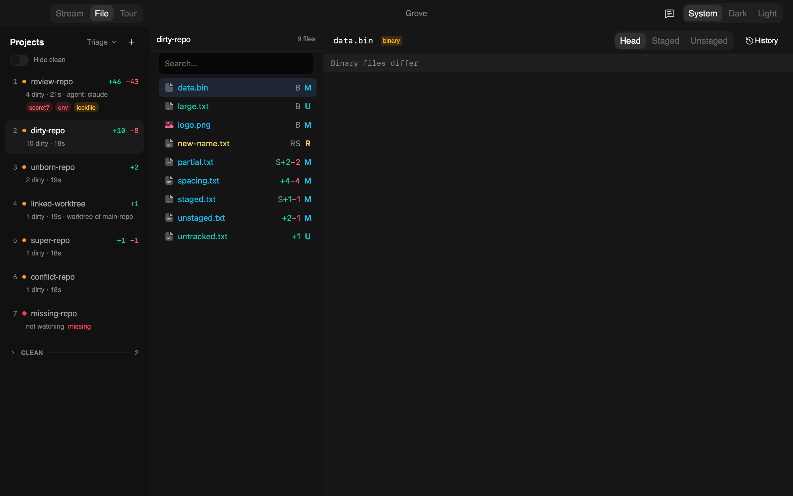

Duration: 334 ms

### PASS — text-diff-unstaged

**Expected:** unstaged.txt renders a unified text diff whose added/removed rows equal the CLI's +/− for that file.

| check | expected | observed | |
| --- | --- | --- | --- |
| rendered rows | `{"additions":2,"deletions":1,"layout":"single"}` | `{"additions":2,"deletions":1,"layout":"single"}` | ✓ |
| header totals | `true` | `true` | ✓ |

<details><summary>Observed</summary>

```json
"unstaged.txt +2 −1 ‹ hunk 1 of 2 › Head Staged Unstaged Unified Split Wrap Scroll History"
```

</details>

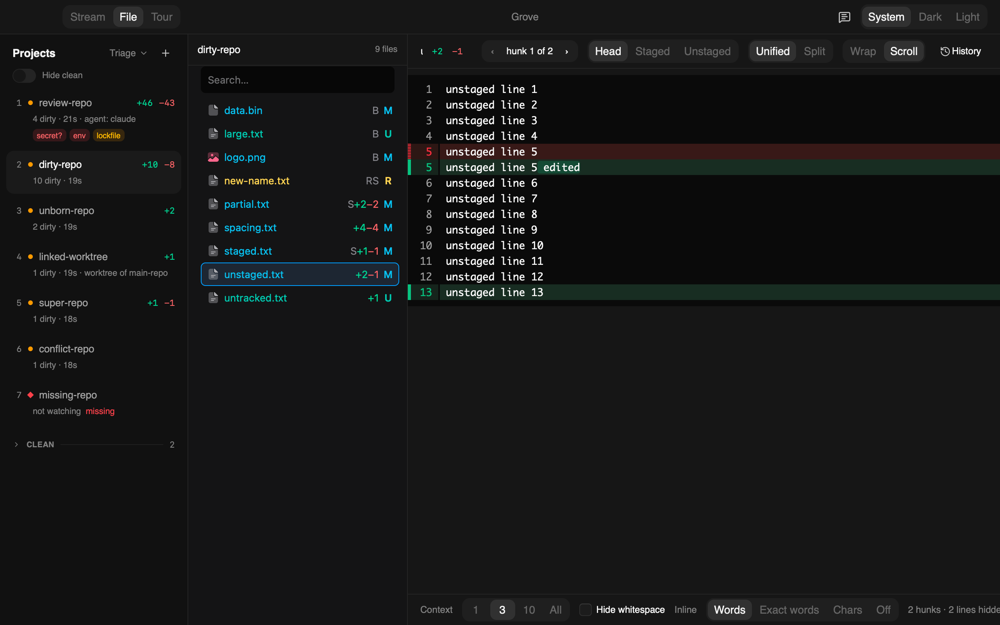

Duration: 257 ms

### PASS — staged-file

**Expected:** staged.txt carries the “staged” badge and renders its one-line change.

| check | expected | observed | |
| --- | --- | --- | --- |
| staged badge | `true` | `true` | ✓ |
| rendered rows | `{"additions":1,"deletions":1}` | `{"additions":1,"deletions":1}` | ✓ |

<details><summary>Observed</summary>

```json
"+1 −1 staged ‹ hunk 1 of 1 › Head Staged Unstaged Unified Split Wrap Scroll History"
```

</details>

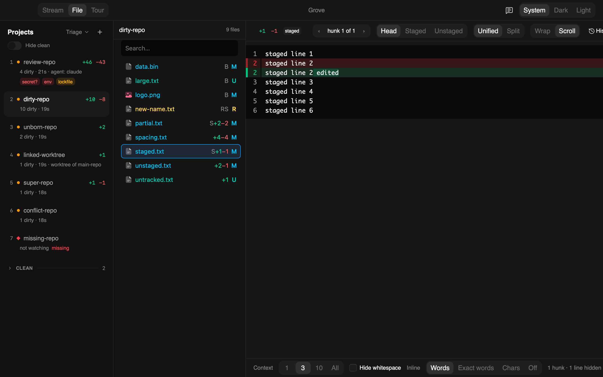

Duration: 254 ms

### PASS — partially-staged-views

**Expected:** partial.txt shows “partially staged” and Head/Staged/Unstaged; Head renders both edits, Staged and Unstaged one each.

| check | expected | observed | |
| --- | --- | --- | --- |
| badge | `true` | `true` | ✓ |
| per-view rows | `{"Staged":{"additions":1,"deletions":1},"Unstaged":{"additions":1,"deletions":1},"Head":{"additions":2,"deletions":2}}` | `{"Head":{"additions":2,"deletions":2},"Staged":{"additions":1,"deletions":1},"Unstaged":{"additions":1,"deletions":1}}` | ✓ |

<details><summary>Observed</summary>

```json
{
  "Head": {
    "additions": 2,
    "deletions": 2
  },
  "Staged": {
    "additions": 1,
    "deletions": 1
  },
  "Unstaged": {
    "additions": 1,
    "deletions": 1
  }
}
```

</details>

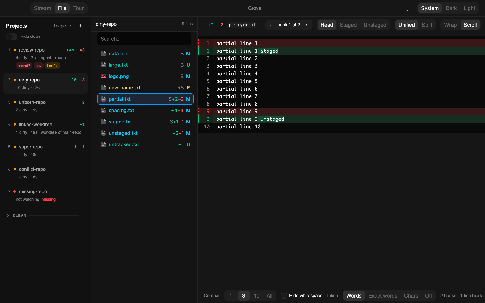

Duration: 1274 ms

### PASS — renamed-file

**Expected:** new-name.txt shows “old-name.txt → new-name.txt”.

| check | expected | observed | |
| --- | --- | --- | --- |
| rename header | `true` | `true` | ✓ |

<details><summary>Observed</summary>

```json
"old-name.txt → new-name.txt staged Head Staged Unstaged Unified Split Wrap Scroll History"
```

</details>

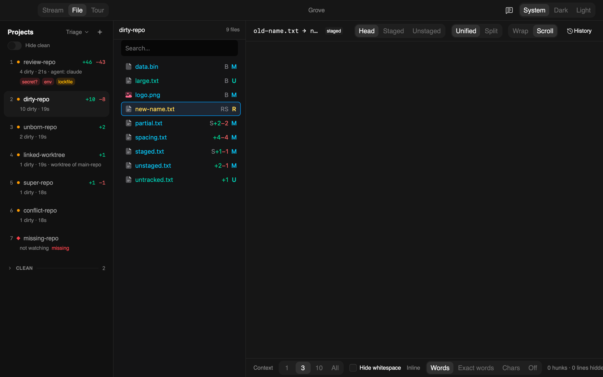

Duration: 258 ms

### PASS — untracked-file

**Expected:** untracked.txt renders as one added row.

| check | expected | observed | |
| --- | --- | --- | --- |
| rendered rows | `{"additions":1,"deletions":0}` | `{"additions":1,"deletions":0}` | ✓ |

<details><summary>Observed</summary>

```json
"untracked.txt +1 ‹ hunk 1 of 1 › Unified Split Wrap Scroll History"
```

</details>

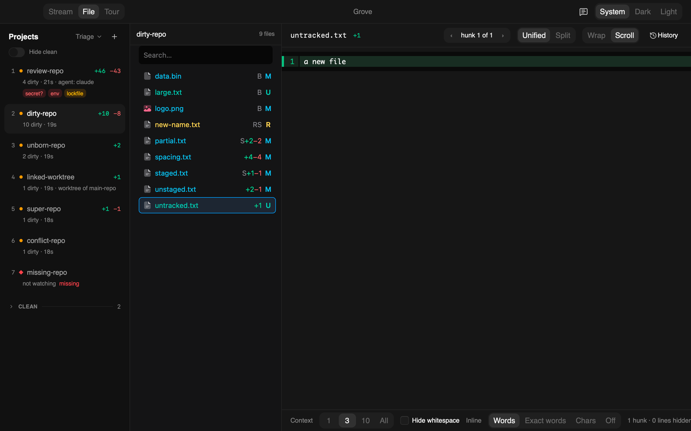

Duration: 254 ms

### PASS — oversized-file

**Expected:** large.txt (over the 512 KiB cap) shows the “truncated by policy” badge; `get_file_diff` withholds both content sides, so the pane renders only the patch.

| check | expected | observed | |
| --- | --- | --- | --- |
| truncated badge | `true` | `true` | ✓ |
| content sides withheld | `{"oldContents":null,"newContents":null}` | `{"oldContents":null,"newContents":null}` | ✓ |

<details><summary>Observed</summary>

```json
{
  "header": "large.txt binary truncated by policy ‹ hunk 1 of 1 › Unified Split Wrap Scroll History",
  "rows": {
    "additions": 1,
    "columns": 1,
    "context": 0,
    "deletions": 0,
    "layout": "single"
  }
}
```

</details>

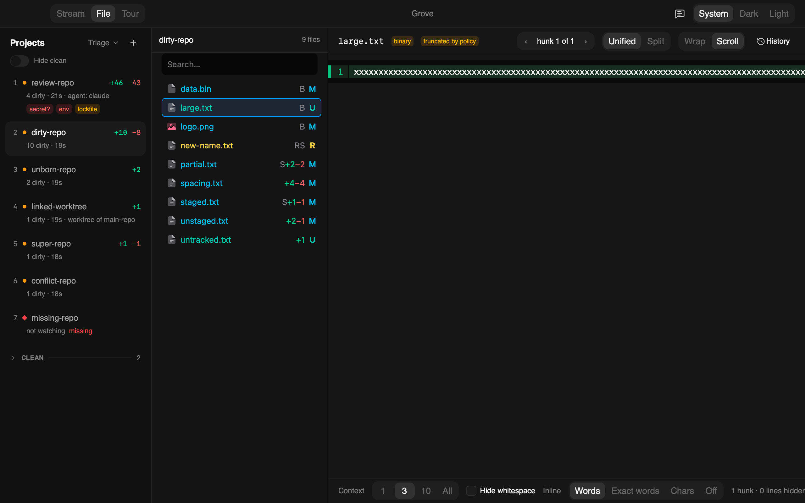

Duration: 457 ms

### PASS — binary-file

**Expected:** data.bin is listed and shows “Binary files differ” with the binary badge.

| check | expected | observed | |
| --- | --- | --- | --- |
| binary message | `true` | `true` | ✓ |
| binary badge | `true` | `true` | ✓ |

<details><summary>Observed</summary>

```json
"data.bin binary Head Staged Unstaged History"
```

</details>

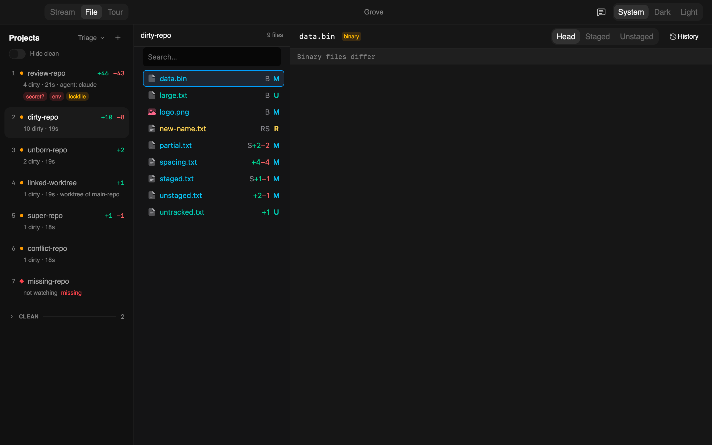

Duration: 251 ms

### PASS — image-file

**Expected:** logo.png renders its Before (HEAD) and After (working tree) images, 24×24 each, in the 2-up mode.

| check | expected | observed | |
| --- | --- | --- | --- |
| images | `[{"alt":"Before · HEAD logo.png","width":24},{"alt":"After · working tree logo.png","width":24}]` | `[{"alt":"Before · HEAD logo.png","width":24},{"alt":"After · working tree logo.png","width":24}]` | ✓ |

<details><summary>Observed</summary>

```json
[
  {
    "alt": "Before · HEAD logo.png",
    "width": 24
  },
  {
    "alt": "After · working tree logo.png",
    "width": 24
  }
]
```

</details>

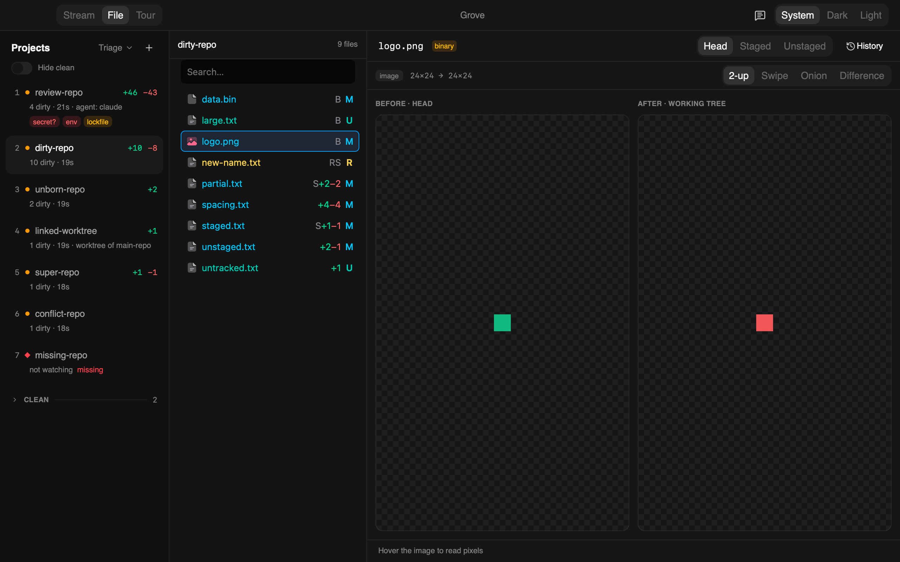

Duration: 270 ms

### PASS — split-toggle

**Expected:** On unstaged.txt, Split renders two code columns with the same changed rows; Unified returns to one column.

| check | expected | observed | |
| --- | --- | --- | --- |
| split | `{"layout":"split","columns":2,"additions":2,"deletions":1}` | `{"layout":"split","columns":2,"additions":2,"deletions":1}` | ✓ |
| unified | `{"layout":"single","columns":1}` | `{"layout":"single","columns":1}` | ✓ |

<details><summary>Observed</summary>

```json
{
  "split": {
    "additions": 2,
    "columns": 2,
    "context": 22,
    "deletions": 1,
    "layout": "split"
  },
  "unified": {
    "additions": 2,
    "columns": 1,
    "context": 11,
    "deletions": 1,
    "layout": "single"
  }
}
```

</details>


Duration: 318 ms

### PASS — hide-whitespace

**Expected:** spacing.txt has three whitespace-only edits and one real edit: 4/4 rows shown; with Hide whitespace, 1/1 rows and header +1 −1; unchecking restores 4/4.

| check | expected | observed | |
| --- | --- | --- | --- |
| shown | `{"additions":4,"deletions":4}` | `{"additions":4,"deletions":4}` | ✓ |
| hidden rows | `{"additions":1,"deletions":1}` | `{"additions":1,"deletions":1}` | ✓ |
| hidden header | `true` | `true` | ✓ |
| restored | `{"additions":4,"deletions":4}` | `{"additions":4,"deletions":4}` | ✓ |

<details><summary>Observed</summary>

```json
{
  "hidden": {
    "header": "spacing.txt +1 −1 ‹ hunk 1 of 1 › Head Staged Unstaged Unified Split Wrap Scroll History",
    "rows": {
      "additions": 1,
      "columns": 1,
      "context": 4,
      "deletions": 1,
      "layout": "single"
    }
  },
  "restored": {
    "additions": 4,
    "columns": 1,
    "context": 1,
    "deletions": 4,
    "layout": "single"
  }
}
```

</details>

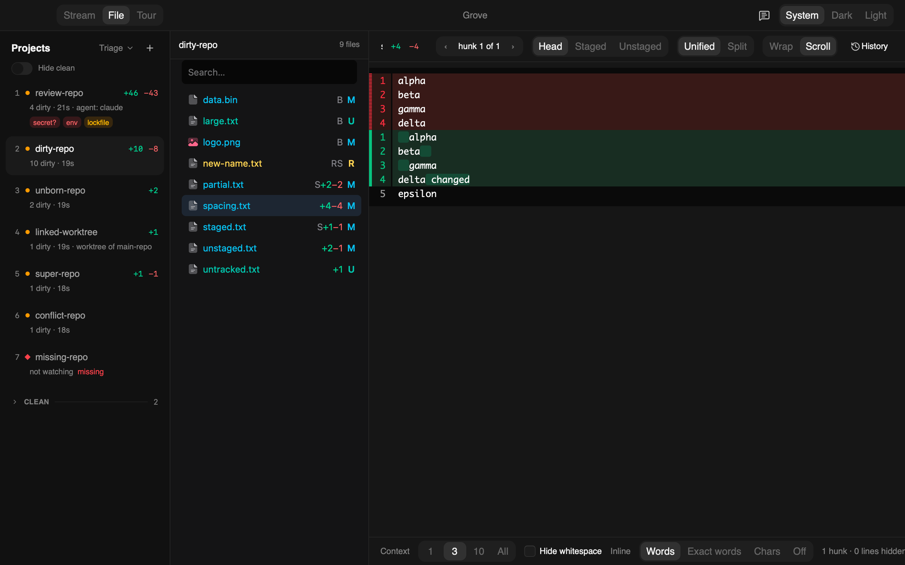

Duration: 332 ms

### PASS — unborn-head

**Expected:** unborn-repo (no commits) lists its staged and untracked files and diffs first.txt against the empty tree.

| check | expected | observed | |
| --- | --- | --- | --- |
| tree paths | `["first.txt","notes.txt"]` | `["first.txt","notes.txt"]` | ✓ |
| rendered rows | `{"additions":1,"deletions":0}` | `{"additions":1,"deletions":0}` | ✓ |

<details><summary>Observed</summary>

```json
"+1 staged ‹ hunk 1 of 1 › Head Staged Unstaged Unified Split Wrap Scroll History"
```

</details>

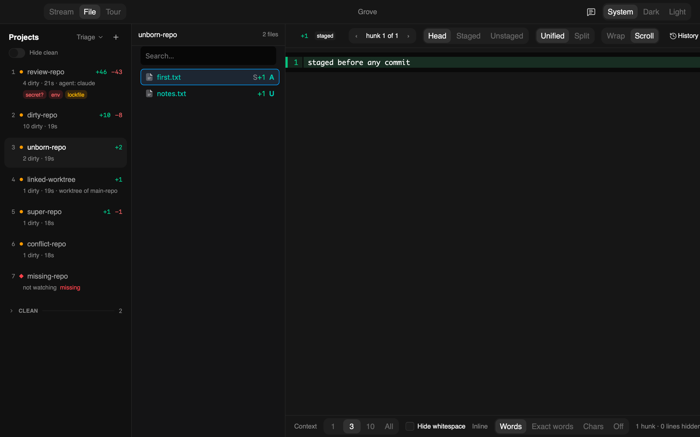

Duration: 263 ms

### PASS — linked-worktree

**Expected:** linked-worktree shows its own edit to app.txt (one added row).

| check | expected | observed | |
| --- | --- | --- | --- |
| rendered rows | `{"additions":1,"deletions":0}` | `{"additions":1,"deletions":0}` | ✓ |

<details><summary>Observed</summary>

```json
"app.txt +1 ‹ hunk 1 of 1 › Head Staged Unstaged Unified Split Wrap Scroll History"
```

</details>

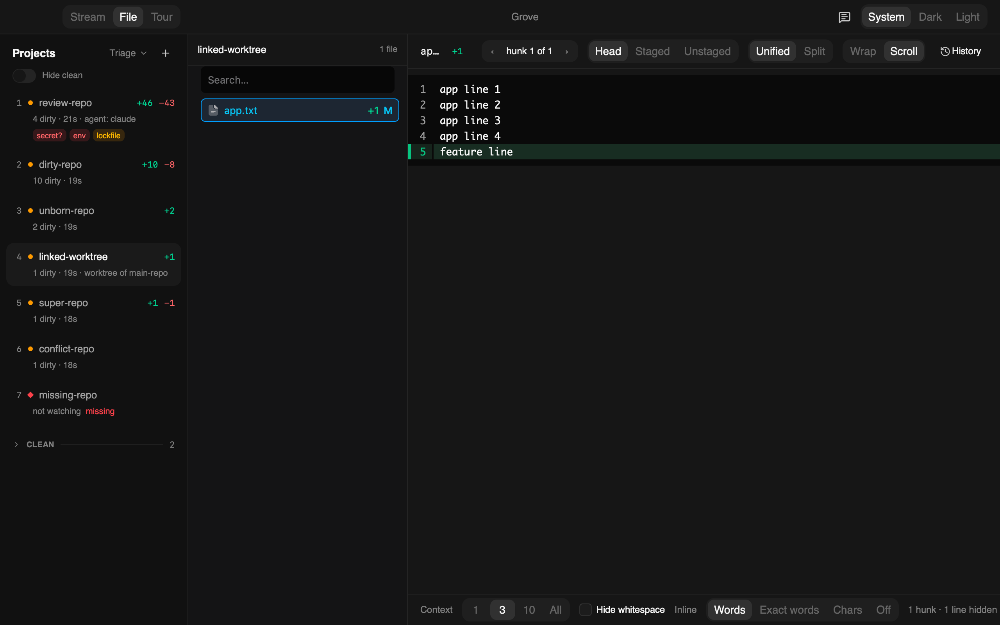

Duration: 271 ms

### PASS — submodule-pointer

**Expected:** super-repo's vendor/sub opens the submodule view: badge, path, and the old → new short commits equal to the fixture's sub-origin HEAD and the moved checkout HEAD.

| check | expected | observed | |
| --- | --- | --- | --- |
| pointer | `"submodule commit 1ac9389 to ab63442"` | `"submodule commit 1ac9389 to ab63442"` | ✓ |
| no error | `null` | `null` | ✓ |

<details><summary>Observed</summary>

```json
{
  "error": null,
  "pointer": "submodule commit 1ac9389 to ab63442",
  "text": "submodule vendor/sub 1ac9389 → ab63442 pointer only, contents not diffed"
}
```

</details>

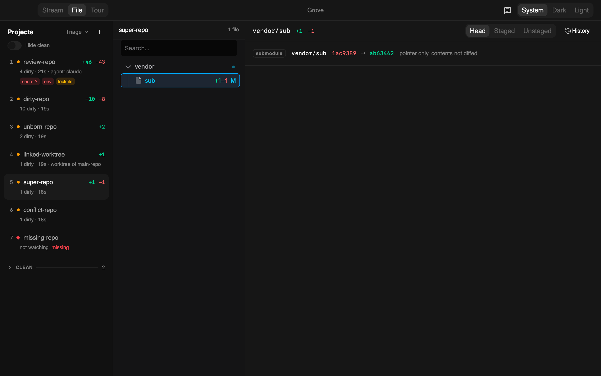

Duration: 254 ms

### PASS — missing-project

**Expected:** Selecting missing-repo shows “Project is missing” with its path and Remove/Locate actions.

| check | expected | observed | |
| --- | --- | --- | --- |
| missing state | `true` | `true` | ✓ |

<details><summary>Observed</summary>

```json
"Projects Triage Hide clean 1 dirty, review-repo +46 −43 4 dirty · 21s · agent: claude secret? env lockfile 2 dirty, dirty-repo +10 −8 10 dirty · 19s 3 dirty, unborn-repo +2 2 dirty · 19s 4 dirty, linked-worktree +1 1 dirty · 19s · worktree of main-repo 5 dirty, super-repo +1 −1 1 dirty · 18s 6 dirty, conflict-repo 1 dirty · 18s 7 missing, missing-repo not watching missing CLEAN 2 Project is missin"
```

</details>

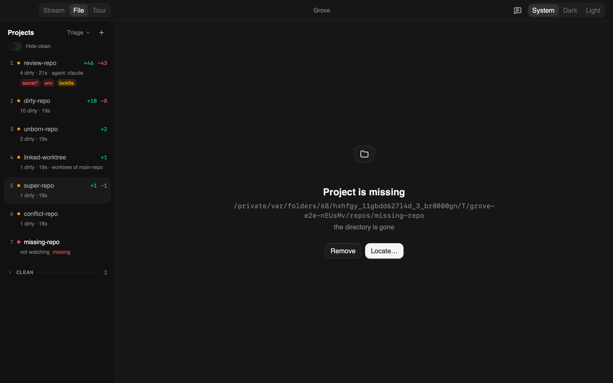

Duration: 96 ms

### PASS — command-palette

**Expected:** ⌘K opens the palette; the Files scope lists review-repo's long.txt for “long”; Enter opens it in the File layout.

| check | expected | observed | |
| --- | --- | --- | --- |
| Files scope lists long.txt | `true` | `true` | ✓ |
| Enter opens it | `"Diff of long.txt"` | `"Diff of long.txt"` | ✓ |
| its project is selected | `"true"` | `"true"` | ✓ |

<details><summary>Observed</summary>

```json
{
  "listed": [
    "long.txt review-repo MModified Enter ↩",
    "logo.png dirty-repo MModified"
  ],
  "opened": "Diff of long.txt",
  "selected": "true"
}
```

</details>

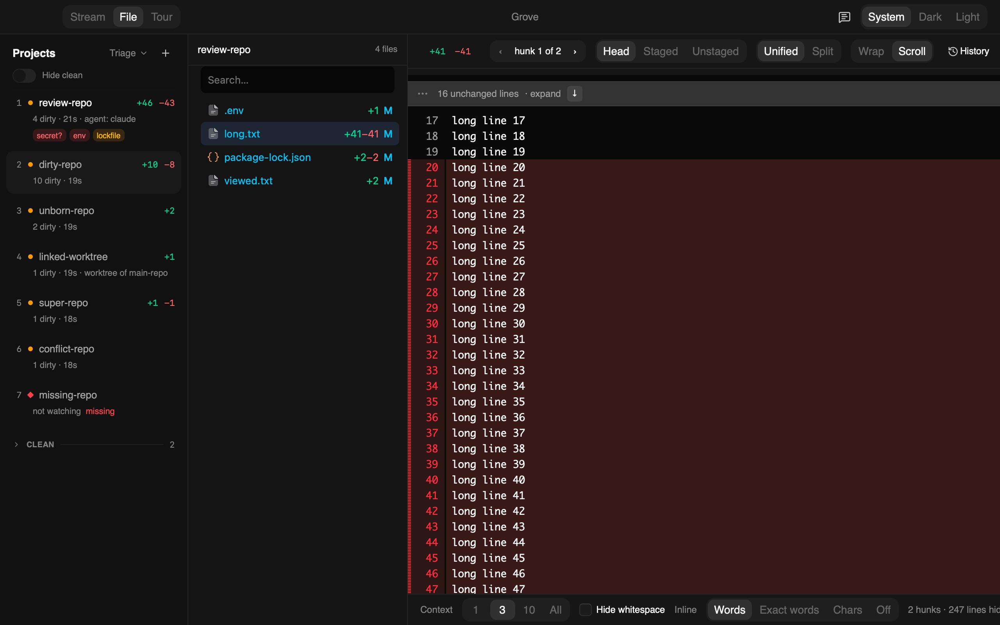

Duration: 263 ms

### PASS — context-lines

**Expected:** On long.txt (unchanged lines 1–19, edits on 20–59 and 280), Context 1 / 3 / All render 1 / 3 / 19 context rows above the first change, and the pane's summary reads 2 hunks · 255 hidden / 2 hunks · 247 hidden / 1 hunk · 0 hidden (the diff is virtualized, so rows are counted where they render: above the first hunk).

| check | expected | observed | |
| --- | --- | --- | --- |
| context rows above the first change | `{"1":1,"3":3,"All":19}` | `{"1":1,"3":3,"All":19}` | ✓ |
| first rendered line | `{"1":19,"3":17,"All":1}` | `{"1":19,"3":17,"All":1}` | ✓ |
| summary | `{"1":"2 hunks · 255 lines hidden","3":"2 hunks · 247 lines hidden","All":"1 hunk · 0 lines hidden"}` | `{"1":"2 hunks · 255 lines hidden","3":"2 hunks · 247 lines hidden","All":"1 hunk · 0 lines hidden"}` | ✓ |

<details><summary>Observed</summary>

```json
{
  "1": {
    "firstLine": 19,
    "leading": 1,
    "summary": "2 hunks · 255 lines hidden"
  },
  "3": {
    "firstLine": 17,
    "leading": 3,
    "summary": "2 hunks · 247 lines hidden"
  },
  "All": {
    "firstLine": 1,
    "leading": 19,
    "summary": "1 hunk · 0 lines hidden"
  }
}
```

</details>

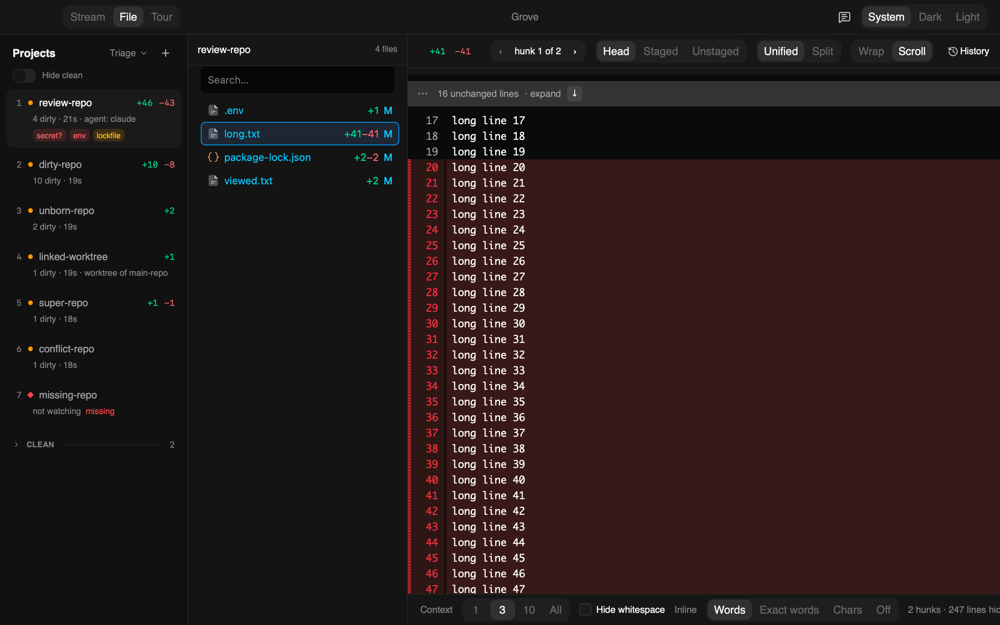

Duration: 1248 ms

### PASS — hunk-navigation

**Expected:** On long.txt, n moves the diff pane's scroll container down to hunk 2 of 2 and p moves it back up to hunk 1.

| check | expected | observed | |
| --- | --- | --- | --- |
| starts at hunk 1 | `"hunk 1 of 2"` | `"hunk 1 of 2"` | ✓ |
| n → hunk 2 | `"hunk 2 of 2"` | `"hunk 2 of 2"` | ✓ |
| n scrolled down | `true` | `true` | ✓ |
| p → hunk 1 | `"hunk 1 of 2"` | `"hunk 1 of 2"` | ✓ |
| p scrolled up | `true` | `true` | ✓ |

<details><summary>Observed</summary>

```json
{
  "back": {
    "position": "hunk 1 of 2",
    "top": 916
  },
  "next": {
    "position": "hunk 2 of 2",
    "top": 1368
  },
  "start": {
    "client": 672,
    "height": 2040,
    "position": "hunk 1 of 2",
    "top": 0
  }
}
```

</details>

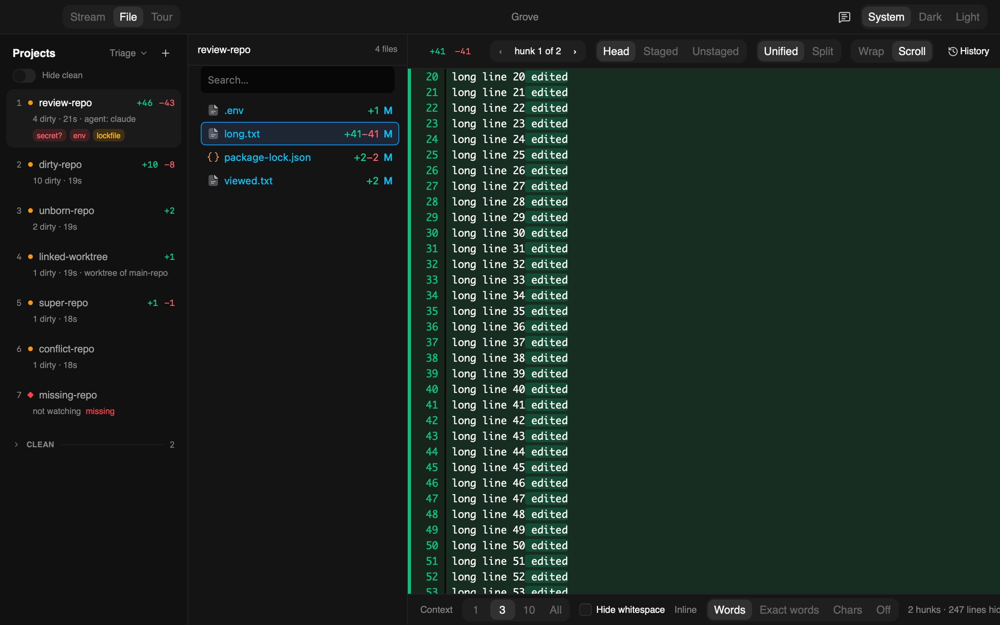

Duration: 1098 ms

### PASS — image-modes

**Expected:** logo.png (green → red) renders Swipe (divider slider), Onion (opacity slider), and Difference (a canvas and “100% of pixels changed”).

| check | expected | observed | |
| --- | --- | --- | --- |
| Swipe divider | `{"mode":"swipe","divider":true}` | `{"mode":"swipe","divider":true}` | ✓ |
| Onion opacity | `{"mode":"onion","opacity":true}` | `{"mode":"onion","opacity":true}` | ✓ |
| Difference canvas | `{"mode":"difference","canvas":true,"share":"100% of pixels changed"}` | `{"mode":"difference","canvas":true,"share":"100% of pixels changed"}` | ✓ |

<details><summary>Observed</summary>

```json
{
  "Swipe": {
    "canvas": null,
    "divider": true,
    "mode": "swipe",
    "opacity": false,
    "share": null
  },
  "Onion": {
    "canvas": null,
    "divider": false,
    "mode": "onion",
    "opacity": true,
    "share": null
  },
  "Difference": {
    "canvas": {
      "height": 24,
      "width": 24
    },
    "divider": false,
    "mode": "difference",
    "opacity": false,
    "share": "100% of pixels changed"
  }
}
```

</details>

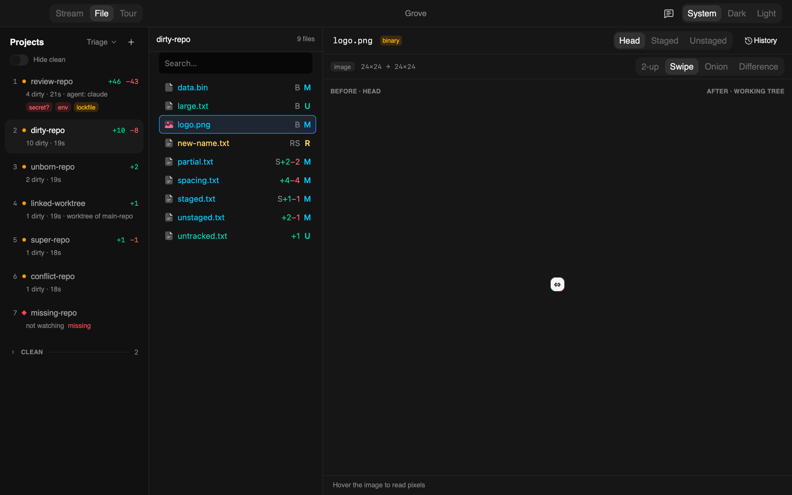

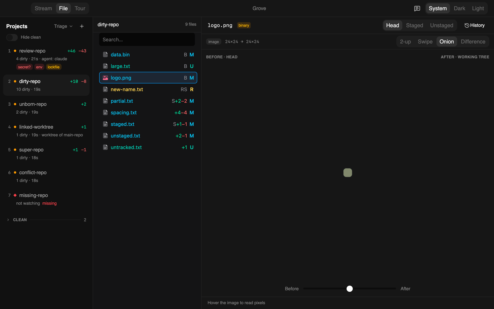

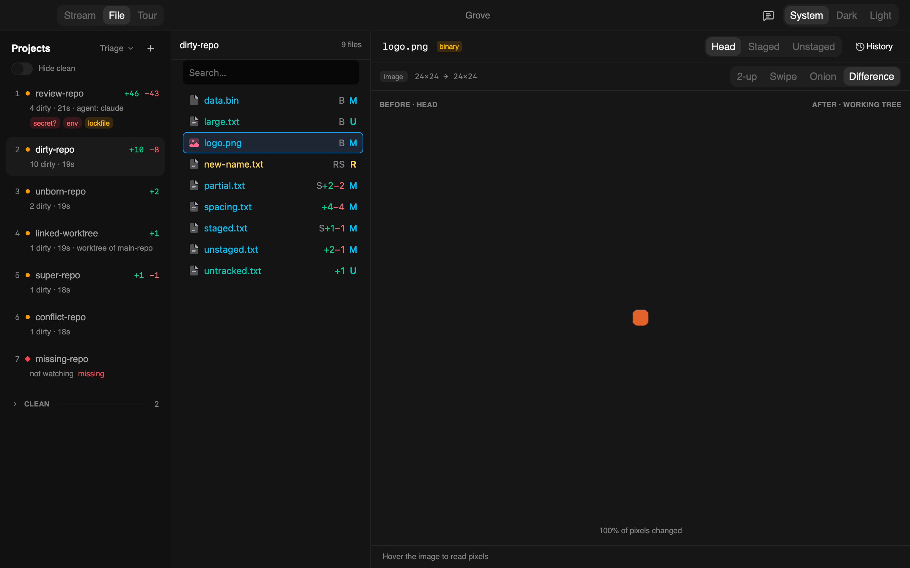


Duration: 1500 ms

### PASS — conflict-view

**Expected:** conflict-repo's conflict.txt (a stopped merge) renders the three-column conflict view: every row has ours/base/theirs cells and the conflict row holds “ours line 4”, “shared line 4”, “theirs line 4” in that order.

| check | expected | observed | |
| --- | --- | --- | --- |
| table | `"Conflict sides: ours, base, theirs"` | `"Conflict sides: ours, base, theirs"` | ✓ |
| three cells per row | `[3]` | `[3]` | ✓ |
| ours | base | theirs | `[true,true,true]` | `[true,true,true]` | ✓ |

<details><summary>Observed</summary>

```json
{
  "columnCounts": [
    3
  ],
  "conflictRows": [
    [
      "4 ours line 4",
      "4 shared line 4",
      "4 theirs line 4"
    ]
  ],
  "header": "conflict 1 conflict Columns Unified conflict 1 of 1 read-only · resolve in your editor Ours HEAD Base merge base Theirs incoming 1 shared line 1 1 shared line 1 1 shared line 1 2 shared line 2 2 share",
  "tableLabel": "Conflict sides: ours, base, theirs"
}
```

</details>

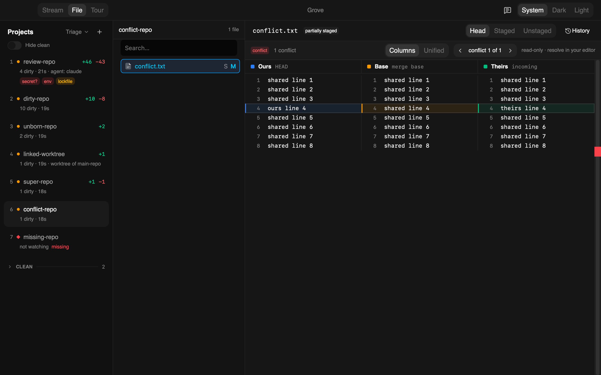

Duration: 267 ms

### PASS — history-panel

**Expected:** ⌘Y opens the history panel for unstaged.txt; Blame lists one line per line of the working copy, the committed lines with a commit and the uncommitted ones as “not committed”; ⌘Y closes it. In a fresh Stream with no click or scroll, ⌘Y still opens the first file of the first dirty project.

| check | expected | observed | |
| --- | --- | --- | --- |
| cold stream ⌘Y switches to the File layout | `true` | `true` | ✓ |
| cold stream ⌘Y opens the first file (.env) | `"History of .env"` | `"History of .env"` | ✓ |
| ⌘Y closes it | `true` | `true` | ✓ |
| stream ⌘Y switches to the File layout | `true` | `true` | ✓ |
| stream ⌘Y shows that file's history | `"History of unstaged.txt"` | `"History of unstaged.txt"` | ✓ |
| panel label | `"History of unstaged.txt"` | `"History of unstaged.txt"` | ✓ |
| one blame line per working-copy line | `["unstaged line 1","unstaged line 2","unstaged line 3","unstaged line 4","unstaged line 5 edited","unstaged line 6","unstaged line 7","unstaged line 8","unstaged line 9","unstaged line 10","unstaged line 11","unstaged line 12","unstaged line 13"]` | `["unstaged line 1","unstaged line 2","unstaged line 3","unstaged line 4","unstaged line 5 edited","unstaged line 6","unstaged line 7","unstaged line 8","unstaged line 9","unstaged line 10","unstaged line 11","unstaged line 12","unstaged line 13"]` | ✓ |
| uncommitted lines marked | `true` | `true` | ✓ |
| committed lines carry a commit | `true` | `true` | ✓ |

<details><summary>Observed</summary>

```json
{
  "label": "History of unstaged.txt",
  "lines": 13,
  "first": [
    [
      "28140cc Grove E2E 33s",
      "1",
      "unstaged line 1"
    ],
    [
      "",
      "2",
      "unstaged line 2"
    ],
    [
      "",
      "3",
      "unstaged line 3"
    ]
  ]
}
```

</details>

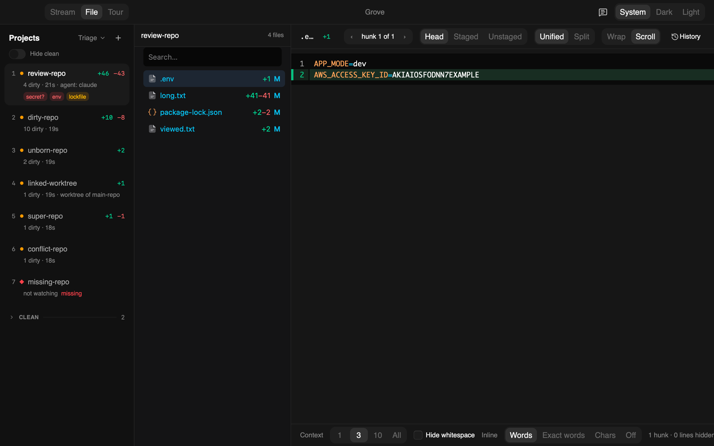

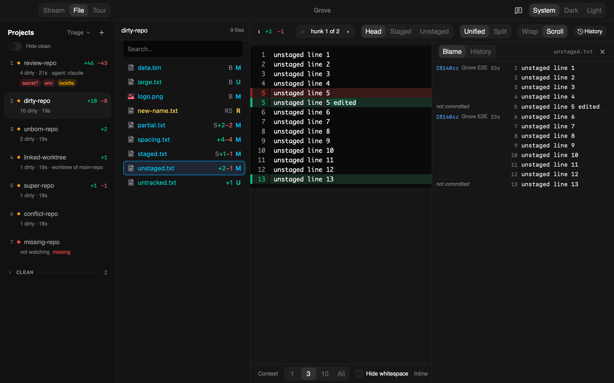

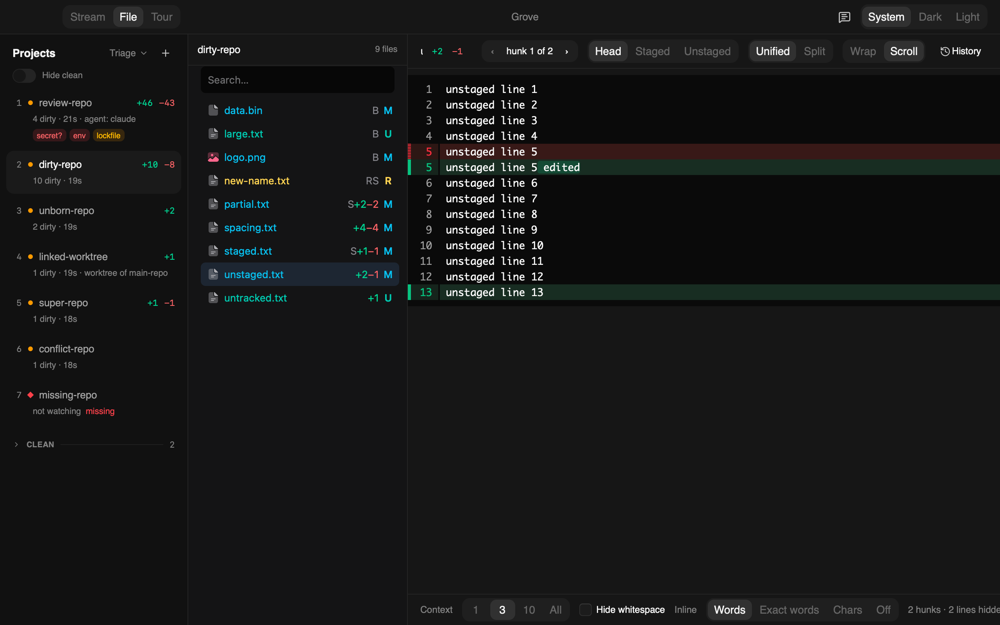


Duration: 3387 ms

### PASS — settings-panel

**Expected:** ⌘, opens the Settings panel with its sections; Close settings dismisses it.

| check | expected | observed | |
| --- | --- | --- | --- |
| sections | `true` | `true` | ✓ |
| closes | `true` | `true` | ✓ |

<details><summary>Observed</summary>

```json
{
  "sections": [
    "General",
    "Keyboard",
    "About"
  ],
  "text": "Settings General Keyboard About General APPEARANCE Theme System follows macOS light and dark mode. System Dark Light UPDATES Stable channel Signed releases only. Grove checks when you ask and never in"
}
```

</details>

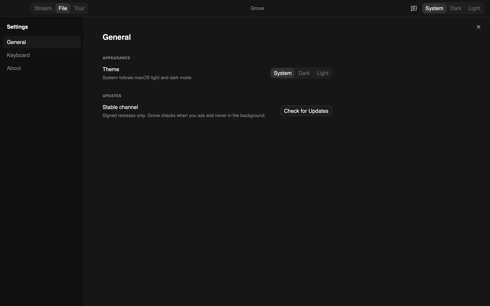


Duration: 193 ms

### PASS — deep-link-navigate

**Expected:** A `grove://navigate` event (the one deep links emit, dispatched through the webview's event IPC so nothing is brought forward) selects review-repo and opens viewed.txt; an unregistered project shows the inline notice instead.

| check | expected | observed | |
| --- | --- | --- | --- |
| file opened | `"Diff of viewed.txt"` | `"Diff of viewed.txt"` | ✓ |
| project selected | `"true"` | `"true"` | ✓ |
| unregistered notice | `"A grove:// link asked for /private/var/folders/68/hxhfgy_11gbdd627l4d_3_br0000gn/T/grove-e2e-nEUsMv/repos/not-registered-repo, which is not a registered project."` | `"A grove:// link asked for /private/var/folders/68/hxhfgy_11gbdd627l4d_3_br0000gn/T/grove-e2e-nEUsMv/repos/not-registered-repo, which is not a registered project."` | ✓ |

<details><summary>Observed</summary>

```json
{
  "opened": "Diff of viewed.txt",
  "selected": "true",
  "notice": "A grove:// link asked for /private/var/folders/68/hxhfgy_11gbdd627l4d_3_br0000gn/T/grove-e2e-nEUsMv/repos/not-registered-repo, which is not a registered project."
}
```

</details>

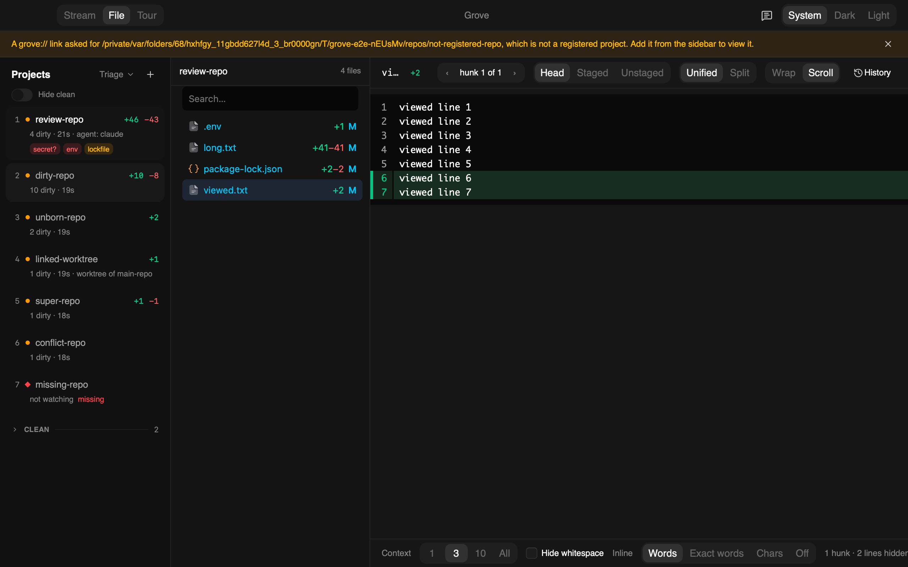

Duration: 129 ms

### PASS — live-external-edit

**Expected:** An external append to the unchanged live.txt adds it to the tree and bumps the sidebar unstaged count within 1000 ms; an external edit to the open unstaged.txt re-renders its rows within 1000 ms. No focus change is made.

| check | expected | observed | |
| --- | --- | --- | --- |
| tree + sidebar updated | `true` | `true` | ✓ |
| tree + sidebar latency ≤ 1000 ms | `true` | `true` | ✓ |
| open diff re-rendered | `true` | `true` | ✓ |
| open diff latency ≤ 1000 ms | `true` | `true` | ✓ |
| focus unchanged | `false` | `false` | ✓ |

<details><summary>Observed</summary>

```json
{
  "tree": {
    "focusAfter": false,
    "focusBefore": false,
    "seenAt": 1790439261291,
    "updated": true,
    "visibility": "visible",
    "writtenAt": 1790439260908,
    "latencyMs": 383
  },
  "openFileEdit": {
    "focusAfter": false,
    "focusBefore": false,
    "seenAt": 1790439261984,
    "updated": true,
    "visibility": "visible",
    "writtenAt": 1790439261595,
    "latencyMs": 389
  }
}
```

</details>


Duration: 1638 ms

### PASS — remove-and-undo

**Expected:** Right-click clean-repo → Remove drops the row and unregisters it in projects.json; the toast's Undo restores the row and the stored path at the same index.

| check | expected | observed | |
| --- | --- | --- | --- |
| row removed | `true` | `true` | ✓ |
| store after remove | `false` | `false` | ✓ |
| store index after undo | `0` | `0` | ✓ |

<details><summary>Observed</summary>

```json
{
  "indexBefore": 0,
  "afterRemove": 8,
  "afterUndo": 9
}
```

</details>

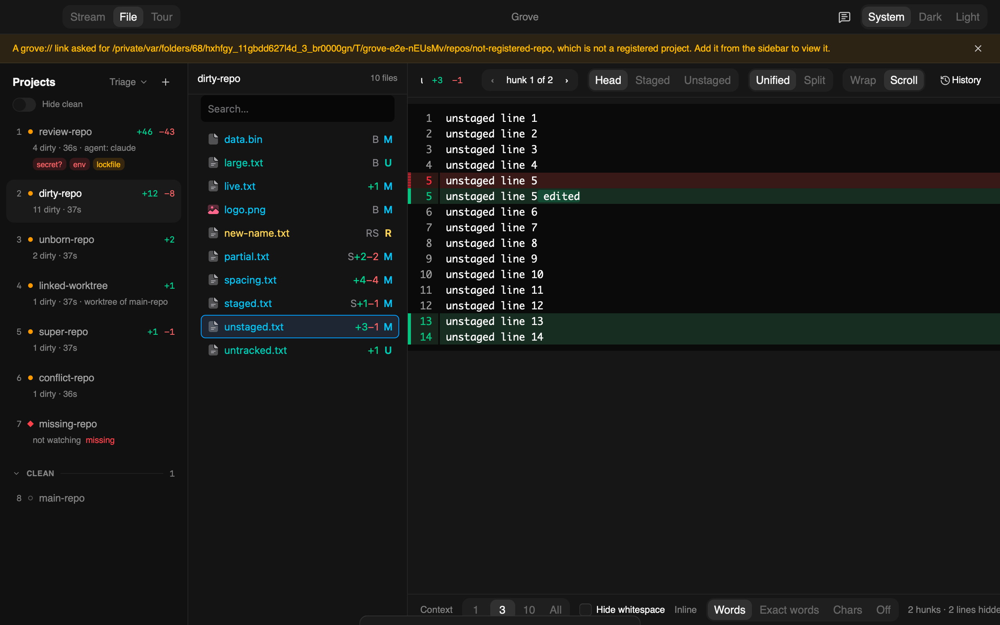

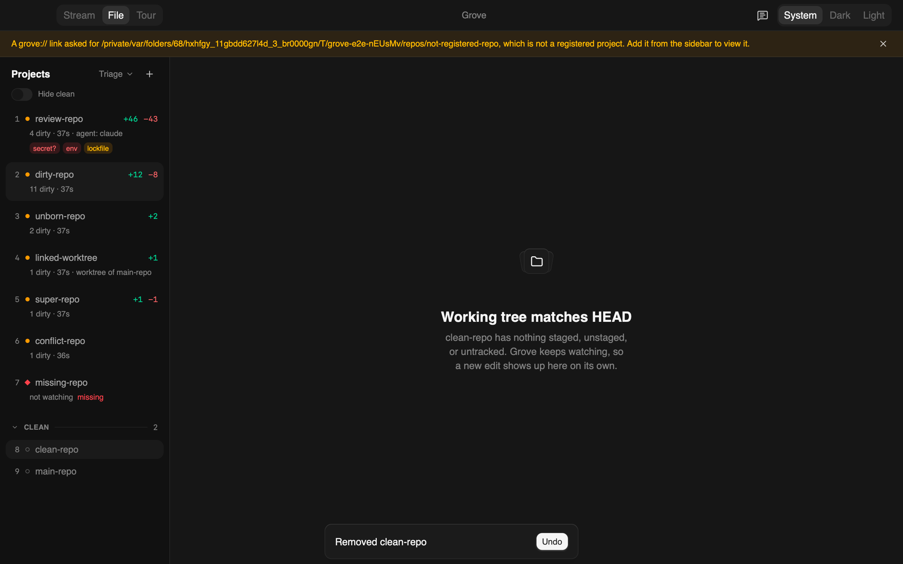

Duration: 254 ms

### PASS — chat-quick-action

**Expected:** Toggle chat opens the Assistant with its quick actions (no turn is sent; set GROVE_E2E_CHAT=1 to send one to a loopback stub).

| check | expected | observed | |
| --- | --- | --- | --- |
| quick actions | `true` | `true` | ✓ |

<details><summary>Observed</summary>

```json
[
  "Explain file",
  "Explain repo",
  "Since last viewed",
  "Draft commit message"
]
```

</details>

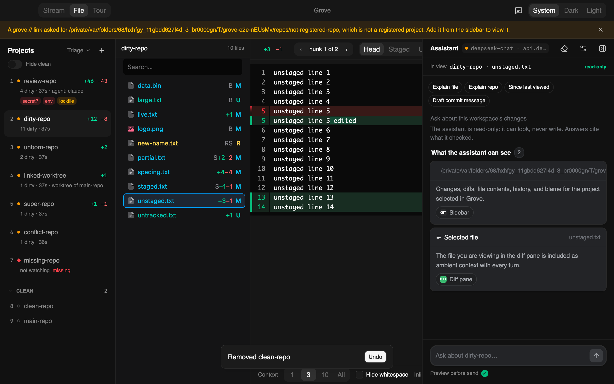

Duration: 361 ms

### PASS — chat-cloud-sheet

**Expected:** With settings pointing at a cloud host (baseUrl http://example.invalid, allowCloudEgress=false), “Explain file” measures the turn locally and shows the “Leaving this machine” sheet with its parts and the egress refusal; Cancel closes it, no turn starts (no chat-egress/done/error event), and nothing reaches any provider.

| check | expected | observed | |
| --- | --- | --- | --- |
| sheet title | `"Leaving this machine"` | `"Leaving this machine"` | ✓ |
| egress refusal shown | `true` | `true` | ✓ |
| sheet lists the measured parts | `true` | `true` | ✓ |
| no turn started (no chat events) | `[]` | `[]` | ✓ |
| no answer added | `0` | `0` | ✓ |
| loopback stub untouched | `0` | `0` | ✓ |

<details><summary>Observed</summary>

```json
{
  "answersBefore": 0,
  "buttons": [
    "Never send this repo",
    "Cancel",
    "Allow cloud egress"
  ],
  "refusal": "cloud egress is off; allow it in chat settings before using example.invalid",
  "rows": [
    "dirty-repo · unstaged.txt 437 B Diffs attached by Grove",
    "Your question 162 B",
    "System prompt + tool schemas 5.5 KB",
    "Conversation (0 turns) 0 B"
  ],
  "title": "Leaving this machine",
  "answers": 0,
  "events": []
}
```

</details>

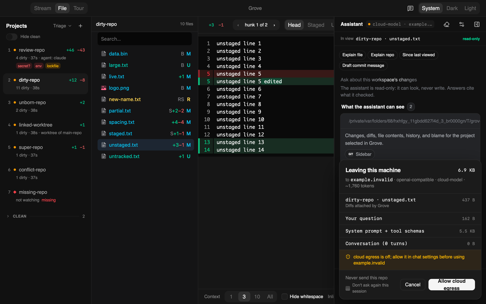

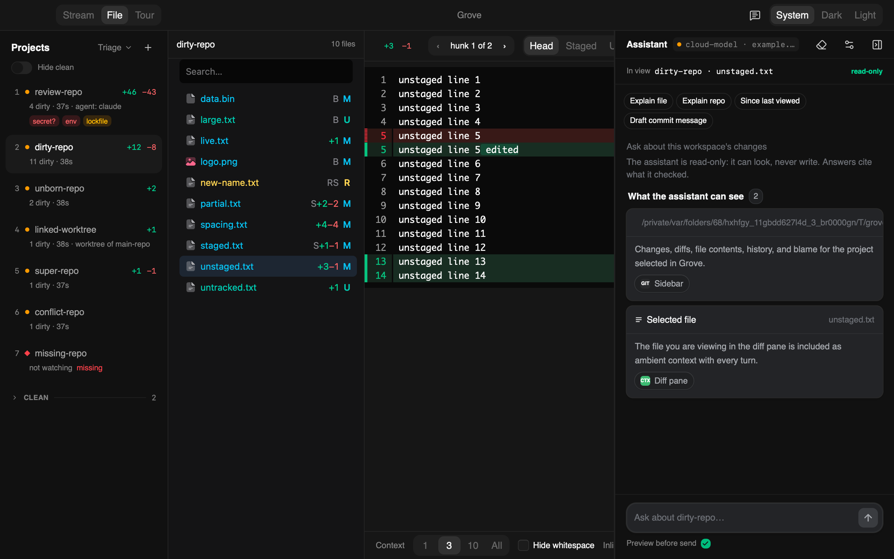

Duration: 1989 ms
